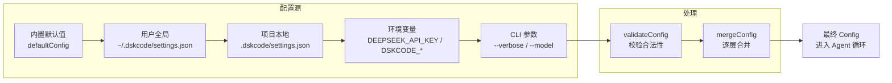

# 配置系统：5 层覆盖 + JSON 加载 + 热重载，给 CLI 工具搭一个生产级配置体系

**TL;DR：** 用 JSON 配置文件替代 TOML，实现 5 层优先级配置流水线（默认值 → 全局配置 → 项目配置 → 环境变量 → CLI 参数）。内置 deepMerge、配置校验、文件热重载。如果检测到未配置 Key，自动弹出交互式输入引导用户完成首次设置。零外部依赖。

---

## 为什么我用 JSON 而不是 TOML

TL;DR 的 TL;DR：**少一个第三方依赖，编辑器原生支持，用户更熟悉。**

最初选型时确实考虑了 TOML。Rust 生态的 Cargo、Python 的 pyproject.toml 都是成功案例。但在一个 TypeScript CLI 工具里用 TOML，意味着多引入一个 `smol-toml` 包：

```
之前: npm install commander smol-toml
现在: npm install commander    ← 少一个依赖
```

JSON 在 Node.js 生态里是内置公民——`JSON.parse` 随 Node 发布，零版本兼容问题。而且对于 CLI 工具的目标用户（前端/Node 开发者），JSON 的熟悉程度远高于 TOML：

- 天天跟 `package.json`、`tsconfig.json` 打交道
- 编辑器语法高亮、格式化默认支持
- API 请求/响应都是 JSON
- `.prettierrc`、`.eslintrc.json` 都是 JSON

TOML 的注释优势在这个场景里其实没那么重要——配置文件写一次就不太会再打开，字段含义在文档里说明就够了。

---

## 架构：5 层配置流水线

```
 优先级低                    优先级高
 ───────────────────────────────────────>
  内置默认值  →  全局 JSON  →  项目 JSON  →  环境变量  →  CLI 参数
                                                                 ↑
                                                         最终覆盖层
```

后一层覆盖前一层，这就是全部规则。简单直接。

### 第 1 层：内置默认值

出厂即可用，零配置启动：

```typescript
export const defaultConfig: Config = {
  defaultProvider: "deepseek",
  maxTokens: 8192,
  temperature: 0.7,
  maxToolRounds: 20,
  providers: [
    {
      name: "deepseek",
      baseUrl: "https://api.deepseek.com",
      model: "deepseek-v4-flash",
    },
  ],
  tools: [
    { name: "read_file", enabled: true },
    { name: "write_file", enabled: true },
    { name: "edit_file", enabled: true },
    { name: "bash", enabled: true },
    { name: "glob", enabled: true },
    { name: "grep", enabled: true },
    { name: "ls", enabled: true },
    { name: "fetch", enabled: true },
  ],
  plugins: [],
};
```

用 `structuredClone` 做深拷贝，避免多个 `loadConfig` 调用共享同一个引用：

```typescript
let config: Config = structuredClone(defaultConfig);
```

### 第 2-3 层：全局配置 + 项目配置

代码里硬编码两处路径：

```typescript
function resolveConfigFiles(configPath?: string): string[] {
  if (configPath) return [configPath];

  const home = process.env.HOME ?? process.env.USERPROFILE ?? "~";
  return [
    join(home, ".dskcode", "settings.json"),      // 用户全局
    join(process.cwd(), ".dskcode", "settings.json"), // 项目本地
  ];
}
```

全局配置放 API Key 这类个人凭证，项目配置放 temperature、maxToolRounds 这类团队约定。两者的关键区别：项目配置可以提交到 Git（不含 Key），全局配置留在个人机器。

### 合并策略：标量覆盖，数组替换

```typescript
function mergeConfig(base: Config, overlay: Partial<Config>): Config {
  const result: Config = { ...base };

  // 标量字段：有值就覆盖
  if (overlay.defaultProvider !== undefined)
    result.defaultProvider = overlay.defaultProvider;
  if (overlay.verbose !== undefined)
    result.verbose = overlay.verbose;

  // 数组字段：整体替换，不合并
  if (overlay.providers !== undefined)
    result.providers = overlay.providers as ProviderConfig[];
  if (overlay.tools !== undefined)
    result.tools = overlay.tools as ToolConfig[];

  return result;
}
```

数组不合并是故意的——如果你在项目配置里重新声明了 `providers`，应该完全替换全局的 provider 列表，而不是追加造成重复。

### 第 4 层：环境变量

支持 6 个环境变量：

| 环境变量 | 作用 | 示例 |
|---|---|---|
| `DEEPSEEK_API_KEY` | 注入 API Key，若 deepseek provider 不存在则自动创建 | `export DEEPSEEK_API_KEY=sk-xxx` |
| `DSKCODE_DEFAULT_PROVIDER` | 覆盖默认 Provider | `deepseek` |
| `DSKCODE_VERBOSE` | 开启详细日志 | `true` |
| `DSKCODE_MAX_TOKENS` | 限制 token 数 | `16384` |
| `DSKCODE_TEMPERATURE` | 设置温度 | `0.3` |
| `DSKCODE_MAX_TOOL_ROUNDS` | 限制工具调用轮次 | `50` |

实现很直观——遍历映射表，读取 `process.env`：

```typescript
function applyEnvVars(config: Config): Config {
  const ENV_MAP: Record<string, keyof Config> = {
    DSKCODE_DEFAULT_PROVIDER: "defaultProvider",
    DSKCODE_VERBOSE: "verbose",
    DSKCODE_MAX_TOKENS: "maxTokens",
    DSKCODE_TEMPERATURE: "temperature",
    DSKCODE_MAX_TOOL_ROUNDS: "maxToolRounds",
  };

  for (const [envKey, configKey] of Object.entries(ENV_MAP)) {
    const raw = process.env[envKey];
    if (raw === undefined) continue;
    // ... 带类型校验的赋值
  }

  // DEEPSEEK_API_KEY 特殊处理：注入到名为 deepseek 的 provider
  const apiKey = process.env.DEEPSEEK_API_KEY;
  if (apiKey) {
    const deepseek = config.providers.find(p => p.name === "deepseek");
    if (deepseek && !deepseek.apiKey) {
      deepseek.apiKey = apiKey;
    }
    // 没有 deepseek provider？自动创建一个
    if (!deepseek) {
      config.providers.unshift({
        name: "deepseek", apiKey, model: "deepseek-v4-flash",
      });
    }
  }
  return config;
}
```

`DEEPSEEK_API_KEY` 做了额外处理——不仅是覆盖，如果配置里根本没有 deepseek provider，自动创建一个默认的。这样用户只需要 `export DEEPSEEK_API_KEY=sk-xxx` 就能直接用，连配置文件都不用碰。

### 第 5 层：CLI 参数

最高优先级。当前支持 `--verbose` 和 `--model`：

```typescript
export function applyCliOverrides(config: Config, flags: CliFlags): Config {
  if (flags.verbose !== undefined)
    config.verbose = flags.verbose;

  if (flags.model !== undefined) {
    const provider = config.providers.find(
      p => p.name === config.defaultProvider,
    );
    if (provider) provider.model = flags.model;
  }

  return config;
}
```

`--model` 不直接覆盖 `config.model`，而是找到当前默认 provider 修改它的 model 字段。这样你就不会改着改着把 provider 的 model 和 defaultProvider 搞脱节。

---

## 第 0 层：交互式 Key 输入（首次运行体验）

前 5 层都是"用户主动配置"，但还有一个隐藏的第 0 层——**用户没有配置任何东西时怎么办？**

当用户第一次运行 `dskcode chat`，经过 5 层流水线后仍然没有找到任何 API Key，这时候直接报错退出是最差的体验。所以我们加了一层兜底：

### 检测

```typescript
export function hasApiKey(providers: Array<{ apiKey?: string }>): boolean {
  if (providers.some((p) => p.apiKey)) return true;
  if (process.env.DEEPSEEK_API_KEY) return true;
  return false;
}
```

遍历所有 provider 检查 apiKey，同时检查 `DEEPSEEK_API_KEY` 环境变量。只要有一个来源有 Key，就静默通过。

### 交互式输入

如果确实没有 Key，用 Node 的 `readline` 模块弹出交互式输入：

```
  ⚠ 未检测到 API Key 配置
  你可以通过以下任一方式配置：
    · 环境变量: export DEEPSEEK_API_KEY=sk-xxx
    · 配置文件: ~/.dskcode/settings.json
    · 下面直接输入，自动保存到全局配置

  🔑 请输入你的 DeepSeek API Key:
```

输入的内容做基本校验（非空、长度至少 10 位），按 Ctrl+C 优雅退出。

### 自动持久化

用户输入的 Key 通过 `saveApiKey()` 写入 `~/.dskcode/settings.json`：

```typescript
export async function saveApiKey(apiKey: string): Promise<string> {
  const home = process.env.HOME ?? process.env.USERPROFILE ?? "~";
  const configDir = join(home, ".dskcode");
  const configFile = join(configDir, "settings.json");

  // 确保目录存在
  await mkdir(configDir, { recursive: true });

  // 读取现有配置
  let configData: Record<string, unknown> = {};
  try {
    const raw = await readFile(configFile, "utf-8");
    configData = JSON.parse(raw);
  } catch {
    // 文件不存在，从头构建
  }

  // 更新或创建 deepseek provider
  const providers = (configData.providers ?? []) as Array<Record<string, unknown>>;
  const existing = providers.find((p) => p.name === "deepseek");

  if (existing) {
    existing.apiKey = apiKey;
  } else {
    providers.push({
      name: "deepseek",
      apiKey,
      baseUrl: "https://api.deepseek.com",
      model: "deepseek-v4-flash",
    });
  }

  configData.providers = providers;
  await writeFile(configFile, JSON.stringify(configData, null, 2), "utf-8");
  return configFile;
}
```

写入后立即重新加载配置，让新 Key 在当前会话中生效，用户无需重启。

### 从 chat 命令串联

```typescript
// src/cli/index.tsx — chat 命令 action 中
let ctx = this.dskcodeCtx;

if (ctx && !hasApiKey(ctx.config.providers)) {
  const key = await promptForApiKey();
  if (!key) process.exit(1);

  const savedPath = await saveApiKey(key);
  console.log(`  API Key 已保存到 ${savedPath}`);

  const result = await loadAndValidate();
  ctx = { ...ctx, config: result.config };
}
```

整个流程是：配置加载完成后 → 检查 Key → 没有？引导输入 → 保存 → 重新加载 → 进入对话。用户全程不需要手动创建任何文件。

---

## 配置校验：不要等到运行时才报错

```typescript
export function validateConfig(config: Config): ConfigError[] {
  const errors: ConfigError[] = [];

  // 1. 至少需要一个 Provider
  if (!config.providers || config.providers.length === 0) {
    errors.push({ field: "providers", message: "至少需要配置一个 Provider..." });
  }

  // 2. 每个 Provider 必须有 name 和 model
  for (let i = 0; i < config.providers.length; i++) {
    const p = config.providers[i]!;
    if (!p.name)  errors.push({ field: `providers[${i}].name`, ... });
    if (!p.model) errors.push({ field: `providers[${i}].model`, ... });
  }

  // 3. defaultProvider 必须存在于 providers 列表中
  // 4. temperature 必须在 0.0 ~ 2.0 之间
  // 5. maxToolRounds 必须 >= 1

  return errors;
}
```

校验错误不 throw，而是作为数组返回。上层决定怎么处理——在 middleware 里，verbose 模式下打印警告，但不阻断执行。这样配置有问题时用户能看到提示，又不至于因为一个警告就卡住。

---

## 配置热加载：改完文件立刻生效

```typescript
export function watchConfig(
  callback: ConfigChangeCallback,
  configPath?: string,
): () => void {
  const filePaths = resolveConfigFiles(configPath)
    .filter(fp => existsSync(fp));

  // 所有文件都不存在？监听项目本地路径（即使还没创建）
  if (filePaths.length === 0) {
    filePaths.push(join(process.cwd(), ".dskcode", "settings.json"));
  }

  const watchers: ReturnType<typeof watch>[] = [];
  let debounceTimer: ReturnType<typeof setTimeout> | undefined;

  for (const filePath of filePaths) {
    const watcher = watch(filePath, (eventType) => {
      if (eventType !== "change") return;

      // 300ms 防抖
      if (debounceTimer) clearTimeout(debounceTimer);
      debounceTimer = setTimeout(async () => {
        const config = await loadConfig(configPath);
        callback(config);
      }, 300);
    });
    watchers.push(watcher);
  }

  return () => {
    if (debounceTimer) clearTimeout(debounceTimer);
    watchers.forEach(w => w.close());
  };
}
```

用 Node 内置的 `fs.watch`，没有额外依赖。300ms 防抖防止编辑器保存时多次触发。返回的 `unwatch` 函数在 Agent 退出时调用，清理资源。

---

## 配置流水线的最终整合

所有层级通过 middleware 串联：

```typescript
export async function loadConfigMiddleware(this: Command): Promise<DskcodeContext> {
  const opts = this.optsWithGlobals();

  // 1-4. 默认值 → JSON → 环境变量
  const result = await loadAndValidate(opts.config);

  // 5. CLI 参数覆盖
  const config = applyCliOverrides(result.config, {
    verbose: opts.verbose,
    model: opts.model,
  });

  // 校验警告（verbose 模式才输出）
  if (result.errors.length > 0 && opts.verbose) {
    for (const msg of result.errors) console.error(`  ⚠ ${msg}`);
  }

  return { config, verbose: opts.verbose ?? false };
}
```

`loadConfig` 返回完整的配置，`validateConfig` 负责检查，`applyCliOverrides` 做最后一层注入。三个函数各自独立，职责分明。

### 踩坑记录：preAction hook 中的 this 指向

最开始实现时踩了一个隐蔽的坑。commander 的 `preAction` hook 回调签名是 `(thisCommand, actionCommand)`：

- `thisCommand` — 注册 hook 的顶层 `program` 对象
- `actionCommand` — 实际被执行的子命令（如 `chat` 命令）

我把 `dskcodeCtx` 存到了 `thisCommand`（program），但 action handler 里 `this` 指向的是 `actionCommand`（chat 子命令）。两者是不同对象，所以子命令里读到的 `this.dskcodeCtx` 一直是 `undefined`。

旧代码靠 `ctx?.xxx ?? 1` 默默兜底，没暴露异常——ctx 是 undefined 就用默认值 1。直到加了 Key 检查 `if (ctx && !hasApiKey(...))`，这个 bug 才浮出水面——ctx 是 undefined 直接跳过了检查。

修复很简单，把 context 挂到 `actionCommand` 上：

```typescript
// 改前：存到 program，子命令读不到
program.hook("preAction", async (thisCommand) => {
  (thisCommand as unknown ...).dskcodeCtx = ctx;
});

// 改后：存到 actionCommand，子命令 this 就能读到
program.hook("preAction", async (thisCommand, actionCommand) => {
  (actionCommand as unknown ...).dskcodeCtx = ctx;
});
```

教训：**hook 的参数和 action 的 `this` 指向不同对象**，跨对象传数据要用正确的那个。

---

## 数据流全景



---

## 这么做的好处

1. **零外部依赖** — JSON 解析用 Node 内置的 `JSON.parse`，配置校验手写，热加载用 `fs.watch`。`package.json` 里少一个包，用户安装快一点，兼容问题少一点

2. **5 层灵活性** — 从内置默认值到 CLI 参数，用户可以在任意一层介入覆盖。新手只设一个环境变量就能跑，老手可以精确控制每个字段

3. **配置校验不阻断** — 错误信息放在 `errors` 数组里，上层按需处理。verbose 模式打印警告，普通模式静默通过。防止因为一个不致命的配置问题卡住用户

4. **自动补全 Key** — 环境变量 `DEEPSEEK_API_KEY` 没配时没有 deepseek provider？`applyEnvVars` 自动创建一个，用户不用手动写任何配置

5. **首次运行兜底** — 5 层流水线都过完还没 Key？`hasApiKey()` 检测到后自动弹出交互式输入，`saveApiKey()` 写入全局配置，用户全程不需要打开编辑器

---

## 取舍

| 做了 | 没做 |
|---|---|
| 5 层配置覆盖 + 交互式 Key 输入 | Schema 定义（可以用 JSON Schema 做更细粒度的校验） |
| 配置校验 | 配置迁移（不改配置名也能兼容旧版本） |
| 文件热重载 | 远程配置（从 HTTP 端点拉配置） |
| 环境变量映射 + API Key 自动持久化 | 配置加密（Key 在磁盘上还是明文） |

不做 Schema 定义是因为当前配置结构够简单，手写校验反而更直观。远程配置和加密可以后面加——`PluginManager` 和权限系统做完之后，自然知道怎么扩展。

---

## 最终效果

用户使用 dskcode 时的真实场景：

```bash
# 场景 0：第一次运行，Key 也没配过（最真实的场景）
dskcode chat
# 自动检测到无 Key → 交互式引导输入 → 保存到 ~/.dskcode/settings.json → 进入对话

# 场景 1：装完直接用（Key 在环境变量里）
export DEEPSEEK_API_KEY=sk-xxx
dskcode chat
# 一切就绪，零配置

# 场景 2：全局写配置文件（一劳永逸）
echo '{
  "defaultProvider": "deepseek",
  "providers": [{ "name": "deepseek", "apiKey": "sk-xxx", "model": "deepseek-v4-flash" }]
}' > ~/.dskcode/settings.json
dskcode chat
# 不用再设环境变量了

# 场景 3：项目级定制行为
echo '{
  "temperature": 0.2,
  "maxToolRounds": 50
}' > .dskcode/settings.json

# 场景 4：临时换模型
dskcode run "重构所有 TODO" --model deepseek-v4-pro
```

---

完整代码：[github.com/Awu12277/deepseek-agent-cli](https://github.com/Awu12277/deepseek-agent-cli)

下一篇聊 Provider 抽象层——怎么让 Agent 无缝切换不同模型后端。
