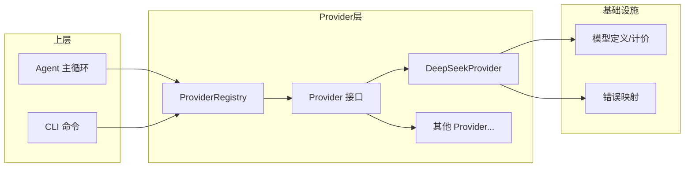

# Provider 抽象层与多模型支持：给 CLI 装上"LLM 引擎"

**TL;DR：** 通过 `Provider` 接口 + 工厂注册表模式，把 LLM 厂商的差异性封装在统一的抽象层后面——目前虽然只集成了 DeepSeek 的两个模型（v4-flash / v4-pro），但架构上随时可以接入第二个、第三个 Provider，完全不需要改 Agent 主循环的代码。

---

## 为什么要抽一层？

如果直接在每个需要调用 LLM 的地方 `fetch("https://api.deepseek.com/chat/completions")`，那：

- 换模型的时候满世界改 URL
- OpenAI 和 DeepSeek 的请求格式就差几个字段，但每个地方都得做兼容
- Agent 主循环要关心网络请求细节，职责混杂
- 没法做"查余额"、"算成本"这些跨 Provider 的统一操作

一个清晰的抽象层，让上层（Agent、CLI）只跟 `Provider` 接口打交道，不管底下是什么模型。

## 架构总览



## 第一步：定义 Provider 接口

接口是整个抽象的基石，它决定了上层怎么用、下层怎么实现：

```typescript
// src/provider/types.ts

/** Provider 接口 — 每个模型后端都需要实现此接口 */
export interface Provider {
  /** Provider 标识符（如 "deepseek"） */
  readonly name: string;

  /** 发起聊天补全请求，返回流式响应 */
  chat(
    messages: ChatMessage[],
    opts?: ChatOptions
  ): AsyncIterable<ChatChunk>;

  /** 统计文本的近似 token 数 */
  countTokens(text: string): number;

  /** 返回当前使用的模型标识 */
  model(): string;
}
```

只有四个方法。`chat` 返回 `AsyncIterable<ChatChunk>`，用 `for await...of` 消费，天然支持流式渲染。

相关的类型定义也是这个层不可或缺的部分：

```typescript
/** 聊天消息 */
interface ChatMessage {
  role: "system" | "user" | "assistant" | "tool";
  content: string;
  toolCallId?: string;   // role=tool 时关联的工具调用 ID
  name?: string;         // role=tool 时的函数名
  toolCalls?: ProviderToolCall[]; // role=assistant 时的工具调用请求
}

/** 流式响应中的一个增量块 */
interface ChatChunk {
  content: string;                       // 文本增量
  finishReason: "stop" | "tool_calls" | "length" | null;
  toolCalls?: ProviderToolCall[];        // 工具调用（跨多个块累积后）
  usage?: UsageInfo;                     // 统计信息，通常在最后一块
}

/** Token 统计 */
interface UsageInfo {
  promptTokens: number;
  completionTokens: number;
  cachedPromptTokens?: number;  // DeepSeek Prefix Cache 命中数
}
```

这里的关键设计决策是两个"开"：

1. **`chat` 返回 `AsyncIterable` 而非 `Promise`**——调用方能逐块拿到增量文本，终端上可以做打字机效果，同时也兼容非流式的场景（包装成单一块即可）。
2. **`toolCalls` 放在 `ChatChunk` 里**——而不是通过回调或独立事件。这意味着工具调用也是"流"的一部分，上游消费逻辑更统一。

## 第二步：工厂注册表模式

接口定义好了，还得有地方管"怎么创建"和"从哪里拿"。注册表（Registry）就是干这个的：

```typescript
// src/provider/registry.ts

/** Provider 工厂函数类型 */
type ProviderFactory = (config: {
  apiKey: string;
  baseUrl: string;
  model: string;
}) => Provider;

export class ProviderRegistry {
  readonly #factories = new Map<string, ProviderFactory>();
  readonly #instances = new Map<string, Provider>();

  /** 注册一个 Provider 工厂 */
  register(name: string, factory: ProviderFactory): void {
    this.#factories.set(name, factory);
  }

  /** 获取或创建一个 Provider 实例（自动缓存） */
  get(
    name: string,
    config: { apiKey: string; baseUrl: string; model: string },
  ): Provider {
    if (!isSupportedModel(config.model)) {
      throw new ModelNotSupportedError(config.model);
    }

    // 相同 name:baseUrl:model 复用同一实例
    const cacheKey = `${name}:${config.baseUrl}:${config.model}`;
    const cached = this.#instances.get(cacheKey);
    if (cached) return cached;

    const factory = this.#factories.get(name);
    if (!factory) {
      throw new Error(
        `未注册的 Provider: "${name}"。可用: ${[...this.#factories.keys()].join(", ")}`
      );
    }

    const instance = factory(config);
    this.#instances.set(cacheKey, instance);
    return instance;
  }

  list(): string[] {
    return [...this.#factories.keys()];
  }

  /** 清除缓存实例（配置热重载时调用） */
  clear(): void {
    this.#instances.clear();
  }
}
```

有几点值得一提：

- **缓存机制**：同样的 `name:baseUrl:model` 组合在不同地方调用 `get` 只会创建一次。这避免了每次对话都 new 一个新 Provider。
- **模型预校验**：`get` 方法内部先调 `isSupportedModel`，用到的模型不在白名单里就直接抛异常，而不是等到 API 调用时才知道。
- **`clear()` 方法**：留给配置热重载用的——用户改了配置文件里的 baseUrl，调用 `clear()` 清空缓存，下次 `get` 自动创建新实例。

然后实例化一个全局默认注册表，并预注册内置的 Provider：

```typescript
// src/provider/registry.ts

export const defaultRegistry = new ProviderRegistry();

defaultRegistry.register("deepseek", (config) => {
  return new DeepSeekProvider({
    apiKey: config.apiKey,
    baseUrl: config.baseUrl,
    model: config.model as ModelId,
  });
});

/** 快捷方式 */
export function createProvider(config: {
  name: string;
  apiKey: string;
  baseUrl: string;
  model: string;
}): Provider {
  return defaultRegistry.get(config.name, config);
}
```

哪天想加 `openai` 了，就是在旁边加一行注册的事：

```typescript
defaultRegistry.register("openai", (config) => {
  return new OpenAIProvider({
    apiKey: config.apiKey,
    baseUrl: config.baseUrl,
    model: config.model,
  });
});
```

Agent 代码一行不用改。

## 第三步：实现 DeepSeek Provider

轮到最重的部分——跟 DeepSeek API 交互。核心是 `chat` 方法：

### 发送请求

```typescript
async *chat(
  messages: ChatMessage[],
  opts?: ChatOptions,
): AsyncIterable<ChatChunk> {
  const url = `${this.#baseUrl}/chat/completions`;

  const body: Record<string, unknown> = {
    model: this.#model,
    messages: this.#mapMessages(messages),
    stream: true,
    max_tokens: opts?.maxTokens,
    temperature: opts?.temperature,
  };

  // DeepSeek 不接受 undefined 字段
  for (const key of Object.keys(body)) {
    if (body[key] === undefined) delete body[key];
  }

  let response: Response;
  try {
    response = await fetch(url, {
      method: "POST",
      headers: {
        "Content-Type": "application/json",
        Authorization: `Bearer ${this.#apiKey}`,
      },
      body: JSON.stringify(body),
      signal: opts?.signal,
    });
  } catch (err) {
    if (opts?.signal?.aborted) return; // 用户手动取消，静默退出
    throw new NetworkError(
      `网络错误：无法连接到 DeepSeek API (${this.#baseUrl})`,
      err instanceof Error ? err : undefined,
    );
  }

  if (!response.ok) {
    const body = await response.text().catch(() => "");
    throw mapHttpError(response.status, body);
  }

  yield* this.#parseStream(response);
}
```

几个要点：

- **`AbortSignal` 支持**：用户按 Ctrl+C 时不要抛异常，直接返回。上层的 Agent 循环自然就结束了。
- **删掉 `undefined` 字段**：DeepSeek API 严格按照 Content-Type 解析 payload，`{"max_tokens": undefined}` 会导致 400。踩过一次这个坑。
- **`yield*` 委托到内部 Generator**：外层只负责网络请求和错误边界，复杂的 SSE 解析逻辑拆到 `#parseStream` 里。

### SSE 流式解析 + 工具调用累积

流式解析本身不复杂，但工具调用（tool calls）是个细节——模型不会在一个块里把完整的工具调用发完，而是在多个 SSE 块中逐步吐出函数名和参数片段：

```
data: {"choices":[{"delta":{"tool_calls":[{"index":0,"id":"call_1","function":{"name":"read_file","arguments":""}}]}}]}

data: {"choices":[{"delta":{"tool_calls":[{"index":0,"function":{"arguments":"{\"path\":"}}]}}}

data: {"choices":[{"delta":{"tool_calls":[{"index":0,"function":{"arguments":"\"src/main.ts\""}}]}}]}

data: {"choices":[{"delta":{},"finish_reason":"tool_calls"}]}
```

所以需要一个累积器，按 `index` 跨块拼接：

```typescript
async *#parseStream(response: Response): AsyncIterable<ChatChunk> {
  const reader = response.body?.getReader();
  if (!reader) throw new ProviderError("响应体为空", "EMPTY_RESPONSE");

  const decoder = new TextDecoder();
  let buffer = "";

  // 工具调用累积器
  const toolCallAccumulator = new Map<number, AccumulatedToolCall>();

  try {
    while (true) {
      const { done, value } = await reader.read();
      if (done) break;

      buffer += decoder.decode(value, { stream: true });
      const lines = buffer.split("\n");
      buffer = lines.pop() ?? "";

      for (const line of lines) {
        const trimmed = line.trim();
        if (!trimmed || trimmed.startsWith(":")) continue;
        if (!trimmed.startsWith("data: ")) continue;

        const data = trimmed.slice(6);
        if (data === "[DONE]") return;

        const chunk = JSON.parse(data) as StreamChunk;
        const choice = chunk.choices?.[0];
        if (!choice) continue;

        const delta = choice.delta;
        const content = delta?.content ?? "";

        // 累积工具调用片段
        if (delta?.tool_calls) {
          for (const tc of delta.tool_calls) {
            const idx = tc.index ?? 0;
            const existing = toolCallAccumulator.get(idx);
            if (!existing) {
              toolCallAccumulator.set(idx, {
                id: tc.id ?? "",
                name: tc.function?.name ?? "",
                arguments: tc.function?.arguments ?? "",
              });
            } else {
              if (tc.id) existing.id = tc.id;
              if (tc.function?.name) existing.name = tc.function.name;
              if (tc.function?.arguments)
                existing.arguments += tc.function.arguments;
            }
          }
        }

        // 某些流中间块只有工具调用数据，没有文本和 finishReason
        if (!content && !choice.finish_reason && !chunk.usage) continue;

        yield {
          content,
          finishReason: mapFinishReason(choice.finish_reason),
          ...(toolCallAccumulator.size > 0
            ? { toolCalls: [...toolCallAccumulator.values()] }
            : {}),
          ...(chunk.usage ? { usage: mapUsage(chunk.usage) } : {}),
        };

        if (choice.finish_reason === "tool_calls") {
          toolCallAccumulator.clear();
        }
      }
    }
  } finally {
    reader.releaseLock(); // 确保释放
  }
}
```

选择"在流结束前逐块 yield 工具调用片段 + 最后一块一起 yield 完整列表"的策略。这不是唯一的选择——也可以全累积完再一次性 yield——但那样会在流式渲染中有个"突然冒出工具调用"的卡顿。

### 错误映射

API 的错误码如果直接透传，上层就要写一堆 `if (err.status === 429)`。做个统一的错误映射，把 HTTP 状态码转成结构化错误类：

```typescript
// src/provider/errors.ts

export class ProviderError extends Error {
  constructor(
    message: string,
    public readonly code: string,
    public readonly statusCode?: number,
  ) {
    super(message);
    this.name = "ProviderError";
  }
}

export class AuthError extends ProviderError { /* 401 / 403 */ }
export class RateLimitError extends ProviderError { /* 429 */ }
export class ServerError extends ProviderError { /* 5xx */ }
export class NetworkError extends ProviderError { /* 网络断开等 */ }
export class ModelNotSupportedError extends ProviderError { /* 不支持的模型 */ }

export function mapHttpError(status: number, body: string): ProviderError {
  switch (status) {
    case 401:
    case 403:
      return new AuthError(`认证失败：请检查 API Key (${status})`, status);

    case 429: {
      let retryAfterMs: number | undefined;
      try {
        const parsed = JSON.parse(body);
        const match = /(\d+)\s*second/i.exec(parsed.error?.message ?? "");
        if (match?.[1]) retryAfterMs = Number(match[1]) * 1000;
      } catch {}
      return new RateLimitError(
        `请求过于频繁，建议等待 ${Math.ceil((retryAfterMs ?? 3_000) / 1000)} 秒`,
        retryAfterMs,
      );
    }

    default:
      if (status >= 500) return new ServerError(`服务端错误 (${status})`, status);
      return new ProviderError(`请求失败 (${status})`, "UNKNOWN_ERROR", status);
  }
}
```

这样 Agent 主循环写重试逻辑时就优雅多了：

```typescript
try {
  for await (const chunk of provider.chat(messages)) { /* ... */ }
} catch (err) {
  if (err instanceof RateLimitError) {
    await sleep(err.retryAfterMs ?? 3000);
    return retry(); // 指数退避
  }
  if (err instanceof AuthError) {
    // 引导用户重新配置 API Key
  }
}
```

## 第四步：模型元数据与 Token 计价

这是被很多人忽视但用户很在意的一层——"这次调用花了多少钱？"

```typescript
// src/provider/models.ts

export const SUPPORTED_MODELS: Record<ModelId, ModelMeta> = {
  "deepseek-v4-flash": {
    id: "deepseek-v4-flash",
    displayName: "DeepSeek V4 Flash",
    contextWindow: 1_000_000,
    inputPricePerMillion: 1,       // 输入 ¥1/百万 token
    outputPricePerMillion: 2,      // 输出 ¥2/百万 token
    cacheHitPricePerMillion: 0.02, // 缓存命中 ¥0.02/百万 token
  },
  "deepseek-v4-pro": {
    id: "deepseek-v4-pro",
    displayName: "DeepSeek V4 Pro",
    contextWindow: 1_000_000,
    inputPricePerMillion: 3,
    outputPricePerMillion: 6,
    cacheHitPricePerMillion: 0.025,
  },
};
```

Token 估算用简单的字符级近似——不依赖 tiktoken，避免多一个原生依赖的开销：

```typescript
export function estimateTokens(text: string): number {
  let cjkCount = 0;
  let otherCount = 0;
  for (const char of text) {
    const code = char.codePointAt(0)!;
    const isCJK =
      (code >= 0x4e00 && code <= 0x9fff) ||           // CJK 统一汉字
      (code >= 0x3400 && code <= 0x4dbf) ||           // 扩展 A
      (code >= 0x20000 && code <= 0x2a6df) ||          // 扩展 B
      (code >= 0xf900 && code <= 0xfaff) ||            // 兼容汉字
      (code >= 0xff01 && code <= 0xff60);              // 全角字符

    if (isCJK) cjkCount++;
    else otherCount++;
  }
  // CJK ≈ 0.6 token/字，其他 ≈ 0.3 token/字符
  return Math.max(1, Math.ceil(cjkCount * 0.6 + otherCount * 0.3));
}
```

费用计算直接挂在这层，从 `UsageInfo` 到用户看到的 `≈¥0.0032`，一步到位：

```typescript
export function calculateCost(usage: UsageInfo, model: ModelId): CostInfo {
  const meta = SUPPORTED_MODELS[model];
  const cached = usage.cachedPromptTokens ?? 0;
  const nonCached = usage.promptTokens - cached;

  return {
    inputCost: (nonCached * meta.inputPricePerMillion) / 1_000_000,
    cacheHitCost: (cached * meta.cacheHitPricePerMillion) / 1_000_000,
    outputCost: (usage.completionTokens * meta.outputPricePerMillion) / 1_000_000,
    totalCost: (
      (nonCached * meta.inputPricePerMillion) +
      (cached * meta.cacheHitPricePerMillion) +
      (usage.completionTokens * meta.outputPricePerMillion)
    ) / 1_000_000,
  };
}
```

## 模块导出

最后通过 `index.ts` 统一对外暴露，调用方只需要 `import { createProvider, ProviderError, formatCost } from "../provider/index.js"`：

```typescript
// 核心类型
export type { Provider, ChatMessage, ChatChunk, UsageInfo, CostInfo, ModelId, ModelMeta };

// 错误类型
export { ProviderError, AuthError, RateLimitError, ServerError, mapHttpError };

// 模型定义与校验
export { SUPPORTED_MODELS, isSupportedModel, estimateTokens, calculateCost, formatCost };

// 工厂注册表
export { ProviderRegistry, defaultRegistry, createProvider } from "./registry.js";

// DeepSeek Provider
export { DeepSeekProvider } from "./deepseek.js";
```

## 现在还只是第一步

整个 Provider 层目前的状态是 **接口就绪（⚡）**：

- [x] `Provider` 接口定义 + 类型系统
- [x] `ProviderRegistry` 工厂注册表 + 实例缓存
- [x] `DeepSeekProvider` 实现（SSE 流式、工具调用累积、余额查询）
- [x] 错误映射系统（5 种结构化错误）
- [x] 模型元数据 + Token 计价
- [ ] Agent 主循环中真正调用 `provider.chat()`
- [ ] 更多 Provider（OpenAI、Anthropic...）

第 7 章的 Agent 主循环会通过 `createProvider` 拿到 Provider 实例，然后 `for await (const chunk of provider.chat(messages))` 处理流式响应——到时会看到这个抽象的完整价值。

## Trade-offs

坦诚说说限制：

- **`countTokens` 只是近似值**。不做 tiktoken 集成意味着数字不精确，尤其是在英文代码场景。但用在成本估算和上下文裁剪上够了。真要精确计数应该等 API 返回的 `usage.prompt_tokens`。
- **`AsyncIterable` 的消费方必须包 `for await...of`**。如果上层想转成 Promise，需要自己 wrapper。不过 CLI 场景天然适合流式，这不算问题。
- **目前只有一个 DeepSeek Provider**。注册表的多模型能力还需要第二个 Provider 来真正验证（计划在后续章节实现 OpenAI 适配器作为参照）。

## 延伸阅读

- [DeepSeek Chat Completions API 文档](https://api-docs.deepseek.com/zh-cn/)
- [Reasonix 原版架构：Provider 设计](https://github.com/esengine/DeepSeek-Reasonix)
- [完整的 Provider 模块源代码](https://github.com/Awu12277/deepseek-agent-cli/tree/main/src/provider)
- 下篇预告：LLM API 客户端：流式补全与错误处理（第 5 章）

---

有什么问题或者想看我接入哪个 Provider，留言说说。
