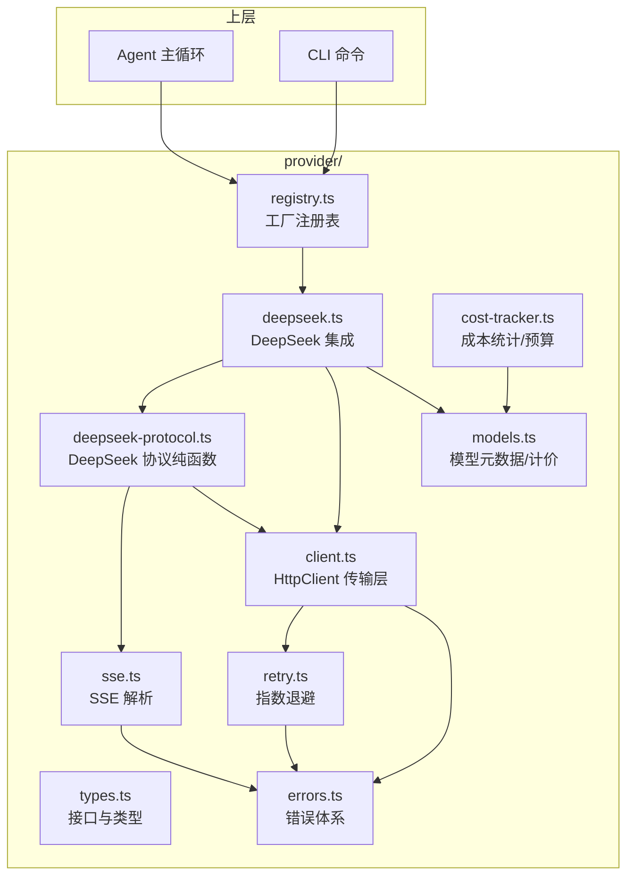

# Provider 抽象层与多模型支持：给 CLI 装上"LLM 引擎"

> **dskcode** 是一个开箱即用的 DeepSeek-native AI 编码 Agent，开源在 [npm: dskcode](https://www.npmjs.com/package/dskcode)。安装后用 `npx dskcode chat` 就能在终端里跑一个交互式对话会话，模型在 `deepseek-v4-flash` / `deepseek-v4-pro` 之间一键切换，工具调用、文件编辑、代码搜索都不在话下。
>
> ```bash
> # 一行启动
> npx dskcode chat
>
> # 指定模型
> npx dskcode chat --model deepseek-v4-pro
> ```
>
> npm 地址：<https://www.npmjs.com/package/dskcode>

**TL;DR：** 通过 `Provider` 接口 + 工厂注册表模式，把 LLM 厂商的差异性封装在统一的抽象层后面——目前虽然只集成了 DeepSeek 的两个模型（v4-flash / v4-pro），但架构上随时可以接入第二个、第三个 Provider，完全不需要改 Agent 主循环的代码。

---

## 为什么要抽一层？

如果直接在每个需要调用 LLM 的地方 `fetch("https://api.deepseek.com/chat/completions")`，那：

- 换模型的时候满世界改 URL
- OpenAI 和 DeepSeek 的请求格式就差几个字段，但每个地方都得做兼容
- Agent 主循环要关心网络请求细节，职责混杂
- 没法做"查余额"、"算成本"这些跨 Provider 的统一操作
- 没法统一做"超时、重试、限流退避"——每换一个厂商都得重写一遍

一个清晰的抽象层，让上层（Agent、CLI）只跟 `Provider` 接口打交道，不管底下是什么模型。

## 架构总览

整个 `src/provider/` 目录拆成 8 个职责清晰的模块：



各模块各司其职：

- `types.ts`：所有接口和数据契约
- `errors.ts`：错误类型 + HTTP 状态码映射 + 可重试判断
- `client.ts`：通用 HTTP 传输（超时、signal 合并、调用重试入口）
- `retry.ts`：指数退避 + 抖动 + 429 Retry-After 优先
- `sse.ts`：纯 SSE 协议解析（与具体 Provider 解耦）
- `models.ts`：模型元数据、Token 估算、费用计算
- `deepseek-protocol.ts`：DeepSeek API 的纯协议层（HTTP + SSE → 原始 chunk）
- `deepseek.ts`：把协议层结果映射到 `Provider` 接口
- `registry.ts`：工厂 + 实例缓存
- `cost-tracker.ts`：会话/日/历史三层成本统计 + 持久化 + 预算控制

把"协议层"和"集成层"分开是关键决策——前者是可替换的纯 HTTP/SSE 函数，后者是适配到 `Provider` 接口的对象。这样未来加 OpenAI 适配器时，复用 `client/sse/retry/errors`，只要写自己的 `openai-protocol.ts` 和 `openai.ts`。

## 第一步：定义 Provider 接口

接口是整个抽象的基石，它决定了上层怎么用、下层怎么实现：

```typescript
// src/provider/types.ts

/** Provider 接口 — 每个模型后端都需要实现此接口 */
export interface Provider {
  /** Provider 标识符（如 "deepseek"） */
  readonly name: string;

  /** 发起聊天补全请求，返回流式响应 */
  chat(
    messages: ChatMessage[],
    opts?: ChatOptions
  ): AsyncIterable<ChatChunk>;

  /** 统计文本的近似 token 数 */
  countTokens(text: string): number;

  /** 返回当前使用的模型标识 */
  model(): string;
}
```

四个方法。`chat` 返回 `AsyncIterable<ChatChunk>`，用 `for await...of` 消费，天然支持流式渲染。

请求侧的 `ChatOptions` 实际比这丰富得多，覆盖了 DeepSeek 几乎所有可调参数：

```typescript
/** 聊天请求选项 */
export interface ChatOptions {
  /** 中止信号，用于取消请求 */
  signal?: AbortSignal;
  /** 本次请求最大生成 token 数 */
  maxTokens?: number;
  /** 生成温度（0.0 ~ 2.0） */
  temperature?: number;
  /** 可用工具定义列表 */
  tools?: ToolDefinition[];

  /** 是否允许深度思考（仅 V4 Flash/Pro 支持） */
  thinkingAllowed?: boolean;
  /** 推理努力等级：'high' | 'max' */
  thinkingEffort?: "high" | "max";
  /** 响应格式：'text' | 'json_object' */
  responseFormat?: "text" | "json_object";
  /** 工具调用策略：'auto' | 'required' | 'none' */
  toolChoice?: "auto" | "required" | "none";
}
```

消息和流式块的相关类型：

```typescript
/** 聊天消息 */
export interface ChatMessage {
  role: "system" | "user" | "assistant" | "tool";
  content: string;
  toolCallId?: string;              // role=tool 时关联 assistant 的工具调用 ID
  name?: string;                    // role=tool 时的函数名
  toolCalls?: ProviderToolCall[];   // role=assistant 时的工具调用请求
}

/** 工具调用（模型返回的 function call） */
export interface ProviderToolCall {
  id: string;
  name: string;
  arguments: string;                // JSON 字符串
}

/** 聊天响应流中的一个增量块 */
export interface ChatChunk {
  content: string;                                // 文本增量
  finishReason: "stop" | "tool_calls" | "length" | null;
  toolCalls?: ProviderToolCall[];                 // 累积到 finish 时一次性给出
  usage?: UsageInfo;                              // 统计信息，通常在最后一块
}

/** Token 使用统计 */
export interface UsageInfo {
  promptTokens: number;
  completionTokens: number;
  cachedPromptTokens?: number;     // DeepSeek Prefix Cache 命中数
}
```

这里的关键设计决策是两个"开"：

1. **`chat` 返回 `AsyncIterable` 而非 `Promise`**——调用方能逐块拿到增量文本，终端上可以做打字机效果，同时也兼容非流式的场景（包装成单一块即可）。
2. **`toolCalls` 放在 `ChatChunk` 里**——而不是通过回调或独立事件。这意味着工具调用也是"流"的一部分，上游消费逻辑更统一。

## 第二步：工厂注册表模式

接口定义好了，还得有地方管"怎么创建"和"从哪里拿"。注册表（Registry）就是干这个的：

```typescript
// src/provider/registry.ts

/** Provider 工厂函数类型 */
type ProviderFactory = (config: {
  apiKey: string;
  baseUrl: string;
  model: string;
}) => Provider;

export class ProviderRegistry {
  readonly #factories = new Map<string, ProviderFactory>();
  readonly #instances = new Map<string, Provider>();

  /** 注册一个 Provider 工厂 */
  register(name: string, factory: ProviderFactory): void {
    this.#factories.set(name, factory);
  }

  /** 获取或创建一个 Provider 实例（自动缓存） */
  get(
    name: string,
    config: { apiKey: string; baseUrl: string; model: string },
  ): Provider {
    if (!isSupportedModel(config.model)) {
      throw new ModelNotSupportedError(config.model);
    }

    // 相同 name:baseUrl:model 复用同一实例
    const cacheKey = `${name}:${config.baseUrl}:${config.model}`;
    const cached = this.#instances.get(cacheKey);
    if (cached) return cached;

    const factory = this.#factories.get(name);
    if (!factory) {
      throw new Error(
        `未注册的 Provider: "${name}"。可用: ${[...this.#factories.keys()].join(", ")}`
      );
    }

    const instance = factory(config);
    this.#instances.set(cacheKey, instance);
    return instance;
  }

  list(): string[] {
    return [...this.#factories.keys()];
  }

  /** 清除缓存实例（配置热重载时调用） */
  clear(): void {
    this.#instances.clear();
  }
}
```

有几点值得一提：

- **缓存机制**：同样的 `name:baseUrl:model` 组合在不同地方调用 `get` 只会创建一次。这避免了每次对话都 new 一个新 Provider。
- **模型预校验**：`get` 方法内部先调 `isSupportedModel`，用到的模型不在白名单里就直接抛 `ModelNotSupportedError`，而不是等到 API 调用时才知道。
- **`clear()` 方法**：留给配置热重载用的——用户改了配置文件里的 baseUrl，调用 `clear()` 清空缓存，下次 `get` 自动创建新实例。

然后实例化一个全局默认注册表，并预注册内置的 Provider：

```typescript
// src/provider/registry.ts

export const defaultRegistry = new ProviderRegistry();

defaultRegistry.register("deepseek", (config) => {
  // 模型合法性已在 registry.get() 中通过 isSupportedModel 校验
  return new DeepSeekProvider({
    apiKey: config.apiKey,
    baseUrl: config.baseUrl,
    model: config.model as ModelId,
  });
});

/** 快捷方式 */
export function createProvider(config: {
  name: string;
  apiKey: string;
  baseUrl: string;
  model: string;
}): Provider {
  return defaultRegistry.get(config.name, config);
}
```

哪天想加 `openai` 了，就是在旁边加一行注册的事：

```typescript
defaultRegistry.register("openai", (config) => {
  return new OpenAIProvider({
    apiKey: config.apiKey,
    baseUrl: config.baseUrl,
    model: config.model as ModelId,
  });
});
```

Agent 代码一行不用改。

## 第三步：通用传输层（HttpClient + Retry + SSE）

在写具体 Provider 之前，先把"所有 Provider 都得用的基础设施"抽出来。

### HttpClient — 通用 HTTP 传输

`HttpClient` 不依赖任何具体厂商，封装 fetch 的连接超时、外部 signal 合并、非 2xx 错误映射：

```typescript
// src/provider/client.ts

export class HttpClient {
  readonly #connectTimeoutMs: number;
  readonly #maxRetries: number;
  readonly #retryBaseDelayMs: number;
  readonly #retryMaxDelayMs: number;

  constructor(config: HttpClientConfig = {}) {
    this.#connectTimeoutMs = config.connectTimeoutMs ?? 30_000;
    this.#maxRetries = config.maxRetries ?? 3;
    this.#retryBaseDelayMs = config.retryBaseDelayMs ?? 1000;
    this.#retryMaxDelayMs = config.retryMaxDelayMs ?? 30_000;
  }

  /** 发起单次 HTTP 请求（带连接超时，不重试） */
  async request(
    url: string,
    init: RequestInit = {},
    options: RequestOptions = {},
  ): Promise<Response> {
    const timeoutMs =
      options.connectTimeoutMs === undefined
        ? this.#connectTimeoutMs
        : options.connectTimeoutMs;

    const headers = new Headers(init.headers);
    if (init.body && typeof init.body === "string" && !headers.has("Content-Type")) {
      headers.set("Content-Type", "application/json");
    }

    const { signal, cleanup } = this.#mergeSignals(
      options.signal,
      timeoutMs,
    );

    let response: Response;
    try {
      response = await fetch(url, { ...init, headers, signal });
    } catch (err: unknown) {
      if (options.signal?.aborted) {
        throw new ProviderError("请求已取消", "ABORTED");
      }
      if (signal?.aborted && !options.signal?.aborted) {
        throw new TimeoutError(
          `连接超时（${timeoutMs}ms）: ${url}`,
          timeoutMs,
        );
      }
      throw new NetworkError(
        `网络错误：无法连接到 ${url}`,
        err instanceof Error ? err : undefined,
      );
    } finally {
      cleanup();
    }

    if (!response.ok) {
      const body = await response.text().catch(() => "");
      throw mapHttpError(response.status, body);
    }

    return response;
  }

  /** 发起带重试的 HTTP 请求（429 / 5xx / 网络错误自动重试） */
  async requestWithRetry(url, init, options) {
    const retryOptions =
      options.retry === false
        ? { maxRetries: 0 }
        : (options.retry ?? {
            maxRetries: this.#maxRetries,
            baseDelayMs: this.#retryBaseDelayMs,
            maxDelayMs: this.#retryMaxDelayMs,
          });
    return withRetry(() => this.request(url, init, options), retryOptions);
  }

  /** 合并外部 signal 与连接超时 signal */
  #mergeSignals(external, timeoutMs) {
    // ... 内部用 AbortController + setTimeout + addEventListener
    // 外部 signal 触发时同步中止内部控制器
  }
}
```

要点：

- **`request` 不重试，`requestWithRetry` 重试**——流式响应一旦获得 2xx，重试就停下来，剩下的稳定性交给 SSE 解析器。
- **超时优先级**：外部 signal 触发时报告"用户取消"（`ABORTED`），内部超时信号触发时报 `TimeoutError`，区分得很清楚。
- **`#mergeSignals`**：用 `AbortController` 合并外部 signal 和超时定时器，两者任一触发都会中止 fetch。

### withRetry — 指数退避

`withRetry` 是个泛型函数，对任何返回 Promise 的操作都适用：

```typescript
// src/provider/retry.ts

/** 计算第 attempt 次重试的退避延迟（毫秒） */
export function computeBackoffDelay(
  attempt: number,
  baseDelayMs: number,
  maxDelayMs: number,
): number {
  // 公式：base * 2^(attempt-1) + jitter
  // jitter ∈ [0, base/2) 避免重试洪峰
  const exp = Math.pow(2, attempt - 1);
  const jitter = Math.random() * (baseDelayMs / 2);
  return Math.min(baseDelayMs * exp + jitter, maxDelayMs);
}

export async function withRetry<T>(
  fn: () => Promise<T>,
  options: RetryOptions = {},
): Promise<T> {
  const maxRetries = options.maxRetries ?? 3;
  const baseDelayMs = options.baseDelayMs ?? 1000;
  const maxDelayMs = options.maxDelayMs ?? 30_000;

  let lastError: unknown;
  for (let attempt = 0; attempt <= maxRetries; attempt++) {
    try {
      return await fn();
    } catch (err: unknown) {
      lastError = err;

      // 非 ProviderError 或不可重试 → 立即抛出
      if (!(err instanceof ProviderError) || !isRetryableError(err)) {
        throw err;
      }

      if (attempt >= maxRetries) break;

      // 429 优先服从 Retry-After，但仍受 maxDelayMs 截断
      let delayMs: number;
      if (err instanceof RateLimitError && err.retryAfterMs !== undefined) {
        delayMs = Math.min(err.retryAfterMs, maxDelayMs);
      } else {
        delayMs = computeBackoffDelay(attempt + 1, baseDelayMs, maxDelayMs);
      }

      options.onRetry?.(attempt + 1, err, delayMs);
      await sleep(delayMs);
    }
  }
  throw lastError instanceof Error ? lastError : new Error("withRetry: 未知错误");
}
```

关键点：

- **可重试判定委托给 `isRetryableError`**——`RateLimitError` / `ServerError` / `NetworkError` 三种才重试，`AuthError` / `BAD_REQUEST` 等一次性错误立即向上抛。
- **429 优先用 `Retry-After`**：服务端说等 30 秒，就老老实实等 30 秒，不被指数退避覆盖。
- **`sleep` 可被 `overrideSleep` 替换**——测试里能直接快进到最终结果，不用真的睡 30 秒。

### parseSSE — 通用 SSE 协议解析

SSE 协议本身不复杂，但要做对细节很多。`parseSSE` 按 [SSE 规范](https://html.spec.whatwg.org/multipage/server-sent-events.html) 逐步解析事件：

```typescript
// src/provider/sse.ts

export async function* parseSSE(
  response: Response,
  options: ParseSSEOptions = {},
): AsyncIterable<SSEEvent> {
  const reader = response.body?.getReader();
  if (!reader) {
    throw new Error("SSE 响应体为空，无法解析");
  }

  const decoder = new TextDecoder();
  let buffer = "";
  let pendingData: string[] = [];
  let pendingEvent: string | undefined;
  // ... pendingId / pendingRetry

  const idleMs = options.idleTimeoutMs ?? 60_000;
  const shouldStopOnDone = options.stopOnDone !== false;

  try {
    while (true) {
      if (options.signal?.aborted) return;

      // 关键：每次 read() 都带超时——空闲过长立即抛 StreamIdleTimeoutError
      const readResult = await readWithTimeout(reader, idleMs, options.signal);
      if (readResult === null) return; // 外部 signal 触发
      const { done, value } = readResult;
      if (done) { /* flush 残余并退出 */ return; }

      buffer += decoder.decode(value, { stream: true });

      let nl: number;
      while ((nl = buffer.indexOf("\n")) !== -1) {
        const line = buffer.slice(0, nl);
        buffer = buffer.slice(nl + 1);
        yield* processLine(line);
        if (streamDone) return;
      }
    }
  } finally {
    reader.releaseLock();
  }
}
```

要点：

- **跨 chunk 续行**：用 `buffer` 保留 `decode` 之后未到 `\n` 的残余，下次 chunk 来了再拼接。
- **多 `data:` 行合并**：同一事件内多个 `data:` 块用 `\n` 拼起来（SSE 规范）。
- **空行触发事件**：`processLine` 遇到空行就调用 `flush()`，把累积的 `pendingData/pendingEvent/pendingId` 组成一个 `SSEEvent` yield 出去。
- **注释行忽略**：以 `:` 开头的行是心跳/注释，丢弃。
- **`[DONE]` 停止迭代**：OpenAI/DeepSeek 用它标记流结束，解析器看到就 `streamDone = true` 并在下次循环 `return`。
- **空闲超时**：`readWithTimeout` 给 `reader.read()` 加了 `setTimeout`，超过 `idleMs` 抛 `StreamIdleTimeoutError`——比"流卡死等 5 分钟"友好太多。
- **`finally` 释放锁**：无论是否异常都会 `reader.releaseLock()`，不会泄漏 fetch 资源。

## 第四步：实现 DeepSeek Provider

把上面的基础设施串起来，就是 DeepSeek Provider。**关键设计：协议层和集成层分开**。

### 协议层 — `deepseek-protocol.ts`

协议层只关心 DeepSeek API 的"线协议"，不依赖 `Provider` 接口类型：

```typescript
// src/provider/deepseek-protocol.ts

/** 发起 DeepSeek Chat Completions 流式请求 */
export async function* streamCompletion(
  client: HttpClient,
  baseUrl: string,
  apiKey: string,
  request: DeepSeekRequest,
  opts?: { signal?: AbortSignal; idleTimeoutMs?: number },
): AsyncIterable<DeepSeekStreamChunk> {
  const url = `${baseUrl}/chat/completions`;
  const idleTimeoutMs = opts?.idleTimeoutMs ?? 60_000;

  const response = await client.requestWithRetry(
    url,
    {
      method: "POST",
      headers: { Authorization: `Bearer ${apiKey}` },
      body: JSON.stringify(request),
    },
    { signal: opts?.signal },
  );

  for await (const evt of parseSSE(response, { idleTimeoutMs, signal: opts?.signal })) {
    if (evt.data === "[DONE]") return;
    let chunk: DeepSeekStreamChunk;
    try {
      chunk = JSON.parse(evt.data) as unknown as DeepSeekStreamChunk;
    } catch {
      continue; // 容忍偶发的格式问题
    }
    yield chunk;
  }
}
```

`getBalance` 走非流式 GET：

```typescript
export async function getBalance(
  client: HttpClient,
  baseUrl: string,
  apiKey: string,
): Promise<BalanceResult> {
  const response = await client.request(`${baseUrl}/user/balance`, {
    method: "GET",
    headers: { Authorization: `Bearer ${apiKey}` },
  });
  const data = (await response.json()) as unknown as DeepSeekBalanceResponse;
  return {
    isAvailable: data.is_available,
    balances: data.balance_infos.map((b) => ({
      currency: b.currency,
      totalBalance: Number(b.total_balance),
      grantedBalance: Number(b.granted_balance),
      toppedUpBalance: Number(b.topped_up_balance),
    })),
  };
}
```

注意 `request` 内部已经把 snake_case 字段名转好了——协议层只做"原样出入"。

### 集成层 — `deepseek.ts`

集成层负责把内部 `ChatMessage` 翻译成 DeepSeek 协议，把 DeepSeek chunk 翻译成内部 `ChatChunk`：

```typescript
// src/provider/deepseek.ts

/** 将内部消息格式映射为 DeepSeek API 请求格式 */
function intoDeepSeekMessages(messages: ChatMessage[]): DeepSeekMessage[] {
  return messages.map((msg) => {
    const mapped: DeepSeekMessage = {
      role: msg.role,
      content: msg.content || null,   // DeepSeek 允许 content 为 null
    };
    if (msg.name) mapped.name = msg.name;
    if (msg.toolCallId) mapped.tool_call_id = msg.toolCallId;
    if (msg.toolCalls && msg.toolCalls.length > 0) {
      mapped.tool_calls = msg.toolCalls.map((tc) => ({
        id: tc.id,
        type: "function" as const,
        function: { name: tc.name, arguments: tc.arguments },
      }));
    }
    return mapped;
  });
}

/** 流式事件映射器 — 负责工具调用累积 + finish_reason 翻译 */
class DeepSeekEventMapper {
  readonly #toolCallsByIndex = new Map<number, AccumulatedToolCall>();

  reset(): void { this.#toolCallsByIndex.clear(); }

  mapEvent(chunk: DeepSeekStreamChunk): ChatChunk[] {
    const choice = chunk.choices?.[0];
    if (!choice) return [];

    const events: ChatChunk[] = [];
    const delta = choice.delta;
    const content = delta?.content ?? "";
    const finishReason = this.#mapFinishReason(choice.finish_reason);

    // 1. 累积工具调用片段（按 index）
    if (delta?.tool_calls) {
      for (const tc of delta.tool_calls) this.#accumulateToolCall(tc);
    }

    // 2. usage 转换
    let usage: UsageInfo | undefined;
    if (chunk.usage) {
      usage = {
        promptTokens: chunk.usage.prompt_tokens,
        completionTokens: chunk.usage.completion_tokens,
        cachedPromptTokens: chunk.usage.prompt_cache_hit_tokens,
      };
    }

    // 3. 在 finish_reason = tool_calls 时一次性 yield 完整工具调用
    const shouldYieldToolCalls =
      finishReason === "tool_calls" && this.#toolCallsByIndex.size > 0;

    // 跳过纯空块
    if (!content && finishReason === null && !shouldYieldToolCalls && !usage) {
      return [];
    }

    events.push({
      content,
      finishReason,
      ...(shouldYieldToolCalls
        ? { toolCalls: [...this.#toolCallsByIndex.values()] }
        : {}),
      ...(usage ? { usage } : {}),
    });

    if (shouldYieldToolCalls) this.#toolCallsByIndex.clear();
    return events;
  }

  #mapFinishReason(reason: string | null) {
    switch (reason) {
      case "stop": return "stop";
      case "tool_calls": return "tool_calls";
      case "length": return "length";
      default: return null;
    }
  }

  #accumulateToolCall(tc: DeepSeekToolCallChunk) {
    const idx = tc.index ?? 0;
    const existing = this.#toolCallsByIndex.get(idx);
    if (!existing) {
      this.#toolCallsByIndex.set(idx, {
        id: tc.id ?? "",
        name: tc.function?.name ?? "",
        arguments: tc.function?.arguments ?? "",
      });
    } else {
      if (tc.id) existing.id = tc.id;
      if (tc.function?.name) existing.name = tc.function.name;
      if (tc.function?.arguments) existing.arguments += tc.function.arguments;
    }
  }
}
```

工具调用分块到达的过程——模型不会在一个块里把完整工具调用发完：

```
data: {"choices":[{"delta":{"tool_calls":[{"index":0,"id":"call_1","function":{"name":"read_file","arguments":""}}]}}]}

data: {"choices":[{"delta":{"tool_calls":[{"index":0,"function":{"arguments":"{\"path\":"}}]}}}

data: {"choices":[{"delta":{"tool_calls":[{"index":0,"function":{"arguments":"\"src/main.ts\""}}]}}]}

data: {"choices":[{"delta":{},"finish_reason":"tool_calls"}]}
```

策略：**在 `finish_reason = "tool_calls"` 那一块一次性 yield 完整工具调用列表**，而不是边流边 yield 中间片段。这样上层消费逻辑（"模型说要做的事"）只在收尾时拿到一次完整结果，处理更简单。

最后是 `DeepSeekProvider` 类本身——只是把协议层和 mapper 拼起来：

```typescript
export class DeepSeekProvider implements Provider {
  readonly #apiKey: string;
  readonly #baseUrl: string;
  readonly #model: ModelId;
  readonly #client: HttpClient;
  readonly #idleTimeoutMs: number;
  readonly #mapper = new DeepSeekEventMapper();

  readonly name = "deepseek";

  constructor(config: DeepSeekProviderConfig) {
    this.#apiKey = config.apiKey;
    this.#baseUrl = config.baseUrl.replace(/\/+$/, "");  // 去掉尾部斜杠
    this.#model = config.model;
    this.#idleTimeoutMs = config.idleTimeoutMs ?? 60_000;
    this.#client = new HttpClient({
      connectTimeoutMs: config.connectTimeoutMs,
      maxRetries: config.maxRetries,
      retryBaseDelayMs: config.retryBaseDelayMs,
      retryMaxDelayMs: config.retryMaxDelayMs,
    });
  }

  model(): string { return this.#model; }
  countTokens(text: string): number { return estimateTokens(text); }

  async getBalance(): Promise<BalanceResult> {
    return protocolBalance(this.#client, this.#baseUrl, this.#apiKey);
  }

  async *chat(messages: ChatMessage[], opts?: ChatOptions): AsyncIterable<ChatChunk> {
    // 1. 构建请求体
    const request: DeepSeekRequest = {
      model: this.#model,
      messages: intoDeepSeekMessages(messages),
      stream: true,
      max_tokens: opts?.maxTokens,
      temperature: opts?.temperature,
      thinking: opts?.thinkingAllowed !== undefined
        ? { type: opts.thinkingAllowed ? "enabled" : "disabled" }
        : undefined,
      reasoning_effort: opts?.thinkingEffort,
      response_format: opts?.responseFormat
        ? { type: opts.responseFormat }
        : undefined,
      tool_choice: opts?.toolChoice,
    };
    if (opts?.tools && opts.tools.length > 0) request.tools = opts.tools;

    // 2. 清空 mapper 状态
    this.#mapper.reset();

    // 3. 调用协议层并 yield 映射后的事件
    const stream = protocolStream(
      this.#client, this.#baseUrl, this.#apiKey, request,
      { signal: opts?.signal, idleTimeoutMs: this.#idleTimeoutMs },
    );
    for await (const rawChunk of stream) {
      const events = this.#mapper.mapEvent(rawChunk);
      for (const event of events) yield event;
    }
  }
}
```

### 错误体系

API 错误如果直接透传状态码，上层就得写一堆 `if (err.status === 429)`。做个统一的错误体系：

```typescript
// src/provider/errors.ts

export class ProviderError extends Error {
  constructor(
    message: string,
    public readonly code: string,
    public readonly statusCode?: number,
  ) {
    super(message);
    this.name = "ProviderError";
  }
}

export class AuthError extends ProviderError { /* 401 / 403 */ }
export class RateLimitError extends ProviderError {
  public readonly retryAfterMs?: number;   // 429 携带的 Retry-After
}
export class ServerError extends ProviderError { /* 5xx */ }
export class NetworkError extends ProviderError { /* fetch 抛错等 */
  readonly originalError?: Error;
}
export class TimeoutError extends ProviderError { /* 连接超时 */
  public readonly timeoutMs: number;
}
export class StreamIdleTimeoutError extends ProviderError { /* SSE 空闲超时 */
  public readonly idleMs: number;
}
export class ModelNotSupportedError extends ProviderError { /* 不支持的模型 */ }

export function mapHttpError(status: number, body: string): ProviderError {
  switch (status) {
    case 401:
    case 403:
      return new AuthError(
        `认证失败：请检查 API Key 是否正确。(${status})`,
        status,
      );

    case 429: {
      // 尝试从响应体中解析 Retry-After
      let retryAfterMs: number | undefined;
      try {
        const parsed = JSON.parse(body) as { error?: { message?: string } };
        const match = /(\d+)\s*second/i.exec(parsed.error?.message ?? "");
        if (match?.[1]) retryAfterMs = Number(match[1]) * 1000;
      } catch {}
      return new RateLimitError(
        `请求过于频繁，请稍后再试。${retryAfterMs ? `建议等待 ${Math.ceil(retryAfterMs / 1000)} 秒。` : ""}`,
        retryAfterMs,
      );
    }

    case 400: {
      let detail = "";
      try {
        const parsed = JSON.parse(body) as { error?: { message?: string } };
        detail = parsed.error?.message ?? "";
      } catch {}
      return new ProviderError(
        `请求参数错误${detail ? `: ${detail}` : ""}`,
        "BAD_REQUEST",
        status,
      );
    }

    default:
      if (status >= 500) {
        return new ServerError(`服务端错误 (${status})，请稍后再试。`, status);
      }
      return new ProviderError(`请求失败 (${status})`, "UNKNOWN_ERROR", status);
  }
}

/** 判断一个 ProviderError 是否可重试 */
export function isRetryableError(err: ProviderError): boolean {
  return (
    err instanceof RateLimitError ||
    err instanceof ServerError ||
    err instanceof NetworkError
  );
}
```

这样 Agent 主循环写重试逻辑就优雅多了：

```typescript
try {
  for await (const chunk of provider.chat(messages)) { /* ... */ }
} catch (err) {
  if (err instanceof RateLimitError) {
    await sleep(err.retryAfterMs ?? 3000);
    return retry();   // 429 通常 HttpClient 已自动重试，这里是兜底
  }
  if (err instanceof AuthError) {
    // 引导用户重新配置 API Key
  }
  if (err instanceof StreamIdleTimeoutError) {
    // 流式空闲过长，可提示用户网络问题或缩短 max_tokens
  }
}
```

## 第五步：模型元数据与 Token 计价

被很多人忽视但用户很在意的一层——"这次调用花了多少钱？"

```typescript
// src/provider/models.ts

export const SUPPORTED_MODELS: Record<ModelId, ModelMeta> = {
  "deepseek-v4-flash": {
    id: "deepseek-v4-flash",
    displayName: "DeepSeek V4 Flash",
    contextWindow: 1_000_000,
    inputPricePerMillion: 1,        // 输入 ¥1/百万 token
    outputPricePerMillion: 2,       // 输出 ¥2/百万 token
    cacheHitPricePerMillion: 0.02,  // 缓存命中 ¥0.02/百万 token
  },
  "deepseek-v4-pro": {
    id: "deepseek-v4-pro",
    displayName: "DeepSeek V4 Pro",
    contextWindow: 1_000_000,
    inputPricePerMillion: 3,
    outputPricePerMillion: 6,
    cacheHitPricePerMillion: 0.025,
  },
};

export const SUPPORTED_MODEL_IDS: string[] = Object.keys(SUPPORTED_MODELS);

export function isSupportedModel(model: string): model is ModelId {
  return model in SUPPORTED_MODELS;
}

export function getModelMeta(model: ModelId): ModelMeta {
  return SUPPORTED_MODELS[model];
}
```

Token 估算用字符级近似——不依赖 tiktoken，避免多一个原生依赖的开销：

```typescript
/**
 * CJK 字符 Unicode 范围检测
 * 覆盖 CJK 统一汉字、扩展 A/B、兼容汉字、全角字符等
 */
function isCJK(char: string): boolean {
  const code = char.codePointAt(0)!;
  return (
    (code >= 0x4e00 && code <= 0x9fff) ||   // CJK 统一汉字
    (code >= 0x3400 && code <= 0x4dbf) ||   // CJK 扩展 A
    (code >= 0x20000 && code <= 0x2a6df) || // CJK 扩展 B 及其他
    (code >= 0xf900 && code <= 0xfaff) ||   // CJK 兼容汉字
    (code >= 0xff01 && code <= 0xff60)      // 全角字符
  );
}

/**
 * 估算文本的 token 数量
 * 1 个英文字符 ≈ 0.3 token；1 个中文字符 ≈ 0.6 token
 */
export function estimateTokens(text: string): number {
  let cjkCount = 0;
  let otherCount = 0;
  for (const char of text) {
    if (isCJK(char)) cjkCount++;
    else otherCount++;
  }
  return Math.max(1, Math.ceil(cjkCount * 0.6 + otherCount * 0.3));
}
```

费用计算直接挂在这层，从 `UsageInfo` 到用户看到的 `≈¥0.0032`，一步到位：

```typescript
/**
 * 计费公式：
 *   输入费用（缓存未命中）= (promptTokens - cachedPromptTokens) × inputPrice / 1,000,000
 *   缓存命中费用         = cachedPromptTokens × cacheHitPrice / 1,000,000
 *   输出费用             = completionTokens × outputPrice / 1,000,000
 *   总费用               = 输入费用 + 缓存命中费用 + 输出费用
 */
export function calculateCost(usage: UsageInfo, model: ModelId): CostInfo {
  const meta = SUPPORTED_MODELS[model];
  const cached = usage.cachedPromptTokens ?? 0;
  const nonCached = usage.promptTokens - cached;

  const inputCost = (nonCached * meta.inputPricePerMillion) / 1_000_000;
  const cacheHitCost = (cached * meta.cacheHitPricePerMillion) / 1_000_000;
  const outputCost = (usage.completionTokens * meta.outputPricePerMillion) / 1_000_000;

  return {
    inputCost,
    cacheHitCost,
    outputCost,
    totalCost: inputCost + cacheHitCost + outputCost,
  };
}

export function formatCost(cost: CostInfo): string {
  return `≈¥${cost.totalCost.toFixed(4)}`;
}
```

## 第六步：成本追踪器（CostTracker）

费用算出来还不够，得能持续追踪。`CostTracker` 提供三层视图：**会话级**（内存）、**日级**（内存 + 持久化）、**历史级**（磁盘）：

```typescript
// src/provider/cost-tracker.ts

export interface CostTrackerOptions {
  /** 成本持久化目录，默认 ~/.dskcode/costs */
  costDir?: string;
  /** 预算上限（元），超过后触发回调，0 表示不限制 */
  budgetLimit?: number;
  /** Token 预算上限 */
  tokenBudgetLimit?: number;
  /** 预算超限回调 */
  onBudgetExceeded?: (tracker: CostTracker) => void;
}

export class CostTracker {
  readonly #costDir: string;
  readonly #budgetLimit: number;
  readonly #tokenBudgetLimit: number;
  readonly #onBudgetExceeded?: (tracker: CostTracker) => void;

  // 会话级（内存）
  #sessionId: string;
  #sessionStartedAt: string;
  readonly #sessionRecords: CostRecord[] = [];

  // 日级（内存缓存 + 启动时从磁盘恢复）
  #todayDate: string;
  #todaySummary: DailyCostSummary;

  #dirty = false;
  #flushInProgress = false;

  constructor(options: CostTrackerOptions = {}) {
    const home = process.env.HOME ?? process.env.USERPROFILE ?? "~";
    this.#costDir = options.costDir ?? join(home, ".dskcode", "costs");
    this.#budgetLimit = options.budgetLimit ?? 0;
    this.#tokenBudgetLimit = options.tokenBudgetLimit ?? 0;
    this.#onBudgetExceeded = options.onBudgetExceeded;

    this.#sessionId = generateSessionId();
    this.#sessionStartedAt = new Date().toISOString();

    const today = getTodayStr();
    this.#todayDate = today;
    this.#todaySummary = createEmptyDailySummary(today);
  }

  /**
   * 记录一次 API 调用。自动计算费用、累加会话/日级统计、写脏标记。
   */
  record(usage: UsageInfo, model: ModelId): CostInfo {
    const cost = calculateCost(usage, model);
    const record: CostRecord = {
      timestamp: new Date().toISOString(),
      model,
      usage: { ...usage },
      cost: { ...cost },
    };
    this.#sessionRecords.push(record);
    this.#ensureTodayBucket();
    this.#addToDaily(record, model);
    this.#dirty = true;
    this.#checkBudget();
    return cost;
  }

  // 便捷 getter：sessionTotalCost / todayTotalCost / sessionPromptTokens ...
  get sessionTotalCost(): number { /* sum of records */ }
  get todayTotalCost(): number { return this.#todaySummary.totalCost; }
  get isBudgetExceeded(): boolean { /* 检查总额与 token 预算 */ }
  get remainingBudget(): number { /* 剩余预算 */ }

  async load(): Promise<void> { /* 从磁盘恢复 #todaySummary */ }
  async flush(): Promise<void> { /* 写回磁盘（原子重命名） */ }
  resetSession(): void { /* 清空 #sessionRecords / 重新生成 sessionId */ }
}
```

关键设计：

- **三层数据天然分离**：会话在内存、今天在内存+磁盘、历史全在磁盘。`#dirty` 标记避免每次 `record` 都写盘。
- **预算超限回调**：`budgetLimit` 和 `tokenBudgetLimit` 都支持 0 表示不限。每次 `record` 后调 `#checkBudget()`，触发回调让上层决定怎么提示。
- **格式化函数家族**：`formatTodayReport()` / `formatSessionCostLine()` / `formatCallCostLine()` 三个函数把数据变成 CLI 友好的多行字符串。
- **持久化格式**：`CostStore` 带 `version: 1` 字段，未来格式迁移有据可循。

## 模块导出

通过 `index.ts` 统一对外暴露，调用方只需要 `import { createProvider, ... } from "../provider/index.js"`：

```typescript
// 核心类型
export type {
  ChatMessage, ChatOptions, ChatChunk, ProviderToolCall, UsageInfo,
  CostInfo, BalanceInfo, BalanceResult, Provider, ModelId, ModelMeta,
  ToolDefinition, ChatCompletionRequest, ClientOptions, SSEEvent,
};

// 错误类型
export {
  ProviderError, AuthError, RateLimitError, ServerError, NetworkError,
  ModelNotSupportedError, TimeoutError, StreamIdleTimeoutError,
  mapHttpError, isRetryableError,
};

// 通用传输
export { HttpClient };
export { parseSSE };

// 重试
export { withRetry, computeBackoffDelay, overrideSleep, DEFAULT_RETRY_OPTIONS };

// 模型定义与校验
export {
  SUPPORTED_MODELS, SUPPORTED_MODEL_IDS,
  isSupportedModel, getModelMeta,
  estimateTokens, calculateCost, formatCost,
};

// 工厂注册表
export { ProviderRegistry, defaultRegistry, createProvider };

// DeepSeek Provider
export { DeepSeekProvider };

// 成本追踪器
export {
  CostTracker, formatMoney, formatTokens, formatCacheHitRate,
  formatTodayReport, formatSessionCostLine, formatCallCostLine,
};
```

## 现在还只是第一步

整个 Provider 层目前的状态是 **接口就绪 + 基础设施就绪（⚡⚡）**：

- [x] `Provider` 接口定义 + 类型系统（含 `ChatOptions` 全字段）
- [x] `ProviderRegistry` 工厂注册表 + 实例缓存
- [x] `HttpClient` 通用 HTTP 传输（超时 / signal 合并 / 错误映射）
- [x] `withRetry` 指数退避（抖动 / 429 Retry-After 优先 / 可注入 sleep）
- [x] `parseSSE` 通用 SSE 解析（按 SSE 规范 / 空闲超时 / AbortSignal）
- [x] `DeepSeekProvider` 协议层 + 集成层分离实现
- [x] 错误体系（7 种结构化错误 + `isRetryableError`）
- [x] 模型元数据 + Token 估算 + 费用计算
- [x] `CostTracker` 三层成本追踪 + 预算控制 + 持久化
- [ ] Agent 主循环中真正调用 `provider.chat()`
- [ ] 更多 Provider（OpenAI、Anthropic...）

第 7 章的 Agent 主循环会通过 `createProvider` 拿到 Provider 实例，然后 `for await (const chunk of provider.chat(messages))` 处理流式响应——到时会看到这个抽象的完整价值。

## Trade-offs

坦诚说说限制：

- **`countTokens` 只是近似值**。不做 tiktoken 集成意味着数字不精确，尤其是在英文代码场景。但用在成本估算和上下文裁剪上够了。真要精确计数应该等 API 返回的 `usage.prompt_tokens`。
- **`AsyncIterable` 的消费方必须包 `for await...of`**。如果上层想转成 Promise，需要自己 wrapper。不过 CLI 场景天然适合流式，这不算问题。
- **目前只有一个 DeepSeek Provider**。注册表的多模型能力还需要第二个 Provider 来真正验证（计划在后续章节实现 OpenAI 适配器作为参照）。
- **协议层耦合在 `deepseek.ts` 文件中**。`deepseek-protocol.ts` 已经把 HTTP/SSE 调用抽出来了，但消息格式转换（`intoDeepSeekMessages`）和事件映射（`DeepSeekEventMapper`）仍紧贴 DeepSeek。第二个 Provider 进来时需要把这部分思路也抽成"协议层模板"，避免重复实现。
- **`HttpClient` 是无状态单例风格**。所有 Provider 实例都自己 new 一个 HttpClient，没有共享连接池。当前 CLI 单进程单请求场景下没问题，并发场景可能需要复用。

## 延伸阅读

- [DeepSeek Chat Completions API 文档](https://api-docs.deepseek.com/zh-cn/)
- [SSE 规范（WHATWG）](https://html.spec.whatwg.org/multipage/server-sent-events.html)
- [完整的 Provider 模块源代码](https://github.com/Awu12277/deepseek-agent-cli/tree/main/src/provider)
- 下篇预告：第 5 章 — LLM API 客户端：流式补全与错误处理

---

有什么问题或者想看我接入哪个 Provider，留言说说。
