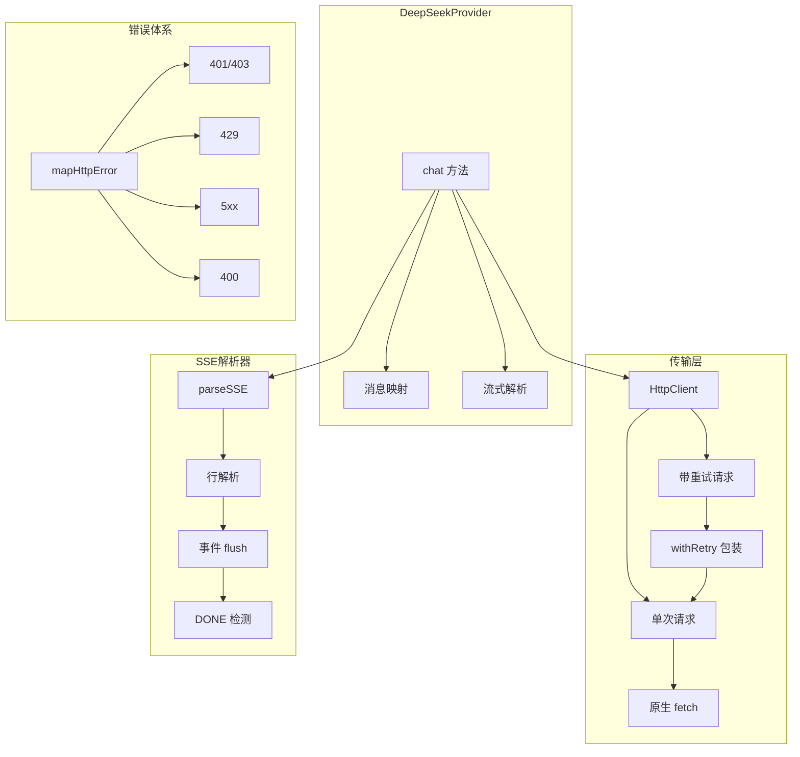
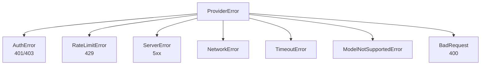

# LLM API 客户端：流式补全与错误处理——让网络请求坚如磐石

**TL;DR：** 从"能发请求"到"生产可用"，差的是一个完整的 HTTP 传输层。本文介绍 dskcode 如何用原生 `fetch` + 手写 SSE 解析器 + 指数退避重试，构建一个容错、可中断、流式稳定的 LLM API 客户端。

---

## 为什么不能直接 `fetch` 就完事？

在实际发起 LLM API 调用时，你会遇到这些问题：

| 场景 | 简单 fetch 的表现 | 生产级客户端的做法 |
|------|--------------------|--------------------|
| DeepSeek 返回 SSE 流 | 需要手动解析 `data:` 行 | 逐行解析、跨块拼接、`[DONE]` 终止 |
| 429 限流 | 直接报错挂掉 | 等待 Retry-After 后重试 |
| 5xx 服务端错误 | 用户看到一个 error | 指数退避自动重试 3 次 |
| DNS / 网络抖动 | 请求直接失败 | 重试 + 错误分类 |
| 用户按 Ctrl+C | 请求在后台继续 | AbortController 优雅取消 |
| 流式响应卡死 | 永远等下去 | 流式空闲超时自动断开 |

一句话：**简单 fetch 只管"发出去"，生产级客户端要管"出事了怎么办"**。

## 模块总览



整个 Provider 层由以下模块组成：

| 模块 | 文件 | 职责 |
|------|------|------|
| 类型定义 | `types.ts` | ChatMessage, ChatChunk, UsageInfo 等完整类型 |
| 模型定义 | `models.ts` | 模型元数据、Token 估算、费用计算 |
| 错误映射 | `errors.ts` | ProviderError 体系、HTTP 状态码映射 |
| SSE 解析 | `sse.ts` | 手写 SSE 流解析器 |
| HTTP 客户端 | `client.ts` | 连接超时、信号合并、请求封装 |
| 重试策略 | `retry.ts` | 指数退避 + 抖动 + Retry-After |
| DeepSeek 适配 | `deepseek.ts` | DeepSeek API 的完整适配 |
| 注册表 | `registry.ts` | 工厂模式管理 Provider 实例 |

## SSE 流式解析：逐字节吃进，逐事件吐出

LLM 的聊天补全 API 返回的是 SSE（Server-Sent Events）流，不是一次性 JSON。每一块文本增量（delta）都通过 `data: {...}\n\n` 的格式逐步到达。

### SSE 协议要点

```
data: {"id":"chatcmpl-xxx","choices":[{"delta":{"content":"Hello"}}]}\n\n
data: {"id":"chatcmpl-xxx","choices":[{"delta":{"content":" world"}}]}\n\n
data: [DONE]\n\n
```

关键点：
1.  事件之间用**空行**分隔
2.  同一事件可以有多行 `data:`，用 `\n` 拼接
3.  `data: [DONE]` 标记流结束
4.  跨网络块的不完整行需要缓冲拼接

### 解析器设计

```typescript
// src/provider/sse.ts
export async function* parseSSE(
  response: Response,
  options: ParseSSEOptions = {},
): AsyncIterable<SSEEvent> {
  const reader = response.body?.getReader();
  const decoder = new TextDecoder();
  let buffer = "";

  // 事件累积器
  let pendingData: string[] = [];
  let pendingEvent: string | undefined;
  // ... 其他字段

  // 遇到 [DONE] 时停止迭代
  const shouldStopOnDone = options.stopOnDone !== false;
  let streamDone = false;

  function* flush(): Generator<SSEEvent> {
    if (pendingData.length === 0) return;
    const evt: SSEEvent = { data: pendingData.join("\n") };
    // ... 附加 event/id/retry 字段
    if (shouldStopOnDone && evt.data === "[DONE]") {
      streamDone = true;
    }
    yield evt;
  }

  while (true) {
    const { done, value } = await readWithTimeout(reader, idleMs, signal);
    if (done) { /* flush 残留 */ return; }

    buffer += decoder.decode(value, { stream: true });
    while ((nl = buffer.indexOf("\n")) !== -1) {
      const line = buffer.slice(0, nl);
      buffer = buffer.slice(nl + 1);
      yield* processLine(line);
      if (streamDone) return;  // [DONE] 后立即停止
    }
  }
}
```

**设计决策：**
-   用 `AsyncGenerator` 暴露流——调用方可以用 `for await...of` 逐块消费
-   `stopOnDone` 选项（默认 `true`）——OpenAI/DeepSeek 兼容 API 用 `[DONE]` 标记结束，SSE 规范本身不要求解析器处理它
-   `idleTimeoutMs` 选项——两次 `reader.read()` 之间的最大等待时间，防止流卡死
-   支持 `AbortSignal`——用户按 Ctrl+C 时优雅退出

## HTTP 客户端：连接超时 + 信号合并

```typescript
// src/provider/client.ts
export class HttpClient {
  async request(url: string, init: RequestInit = {}, options: RequestOptions = {}): Promise<Response> {
    const { signal, cleanup } = this.#mergeSignals(options.signal, timeoutMs);
    try {
      response = await fetch(url, { ...init, headers, signal });
    } catch (err) {
      if (options.signal?.aborted) {
        throw new ProviderError("请求已取消", "ABORTED");
      }
      if (signal?.aborted && !options.signal?.aborted) {
        throw new TimeoutError(`连接超时（${timeoutMs}ms）: ${url}`, timeoutMs);
      }
      throw new NetworkError(`网络错误：无法连接到 ${url}`, ...);
    } finally {
      cleanup();
    }
  }
}
```

### 信号合并策略

一个请求可能同时受到两个中止信号：
1.  **连接超时信号**：HttpClient 内部创建的定时器
2.  **外部用户信号**：`AbortController`（如 Ctrl+C 取消）

```typescript
#mergeSignals(external, timeoutMs) {
  // 无超时且无外部信号 → 不使用信号
  // 无超时 → 直接用外部信号
  // 有超时 → 创建内部 AbortController，同时监听超时和外部信号

  const controller = new AbortController();
  const timer = setTimeout(() => controller.abort(), timeoutMs);

  const onExternalAbort = () => controller.abort();
  if (external) {
    if (external.aborted) controller.abort();
    else external.addEventListener("abort", onExternalAbort, { once: true });
  }

  return { signal: controller.signal, cleanup: () => { clearTimeout(timer); ... } };
}
```

**关键细节：** `cleanup()` 必须在 `finally` 中调用，否则事件监听器会泄漏。

## 指数退避重试：429 半价也要等

```typescript
// src/provider/retry.ts
export async function withRetry<T>(fn: () => Promise<T>, options = {}): Promise<T> {
  for (let attempt = 0; attempt <= maxRetries; attempt++) {
    try {
      return await fn();
    } catch (err) {
      // 非可重试错误 → 立即上拋
      if (!(err instanceof ProviderError) || !isRetryableError(err)) throw err;

      if (attempt >= maxRetries) break;

      // 429 优先使用 Retry-After 提示的等待时间
      let delayMs = err instanceof RateLimitError && err.retryAfterMs
        ? Math.min(err.retryAfterMs, maxDelayMs)
        : computeBackoffDelay(attempt + 1, baseDelayMs, maxDelayMs);

      await sleep(delayMs);
    }
  }
  throw lastError;
}
```

**退避公式**：`base × 2^(attempt-1) + random(0, base/2)`

| 重试次数 | 基准延迟 | 实际延迟范围 |
|---------|---------|-------------|
| 1 | 1000ms | 1000~1500ms |
| 2 | 2000ms | 2000~2500ms |
| 3 | 4000ms | 4000~4500ms |
| 4 | 8000ms | 8000~8500ms |
| 5 | 16000ms | 16000~16500ms |

加上随机抖动防止"重试洪峰"——所有客户端在同一时刻重试会加剧服务端压力。

## DeepSeek 适配器：把 API 响应翻译成内部类型

```typescript
// src/provider/deepseek.ts
export class DeepSeekProvider implements Provider {
  async *chat(messages: ChatMessage[], opts?: ChatOptions): AsyncIterable<ChatChunk> {
    const response = await this.#client.requestWithRetry(url, { ... }, requestOptions);

    // 工具调用累积器：跨多个 SSE 块拼接
    const toolCallAccumulator = new Map<number, AccumulatedToolCall>();

    for await (const evt of parseSSE(response, { idleTimeoutMs, signal })) {
      if (evt.data === "[DONE]") return;

      const chunk = JSON.parse(evt.data) as StreamChunk;
      // ... 累积工具调用片段
      // ... 构建 UsageInfo

      yield {
        content,
        finishReason,
        ...(shouldYieldToolCalls ? { toolCalls: [...] } : {}),
        ...(usage ? { usage } : {}),
      };
    }
  }
}
```

**工具调用的流式拼接**是 SSE 适配的难点。一个工具调用可能跨 3~5 个 SSE 块到达：

```
块1: tool_calls: [{ index: 0, id: "call_abc", function: { name: "bash" } }]
块2: tool_calls: [{ index: 0, function: { arguments: '{"com' } }]
块3: tool_calls: [{ index: 0, function: { arguments: 'mand": "ls"}' } }]
块4: finish_reason: "tool_calls"
```

DeepSeek 适配器用一个 `Map<index, AccumulatedToolCall>` 按块逐步拼接，直到 `finish_reason` 为 `"tool_calls"` 时一次性输出完整的工具调用列表。

## 错误体系：分类明确，处理有据



| 错误类型 | 可重试 | 典型场景 |
|---------|--------|---------|
| `AuthError` | ✗ | API Key 无效 |
| `RateLimitError` | ✓ | 请求太频繁 |
| `ServerError` | ✓ | DeepSeek 内部错误 |
| `NetworkError` | ✓ | DNS 失败、连接超时 |
| `TimeoutError` | ✗ | 连接超时 |
| `StreamIdleTimeoutError` | ✗ | 流式响应卡住 |

`isRetryableError()` 函数判断哪些错误可以重试——`withRetry` 只对可重试错误执行退避，非可重试错误立即上拋。

## 测试覆盖

| 模块 | 测试文件 | 关键测试 |
|------|---------|---------|
| SSE 解析 | `sse.test.ts` | 跨块拆行、[DONE] 终止、CRLF、空闲超时、AbortSignal |
| HTTP 客户端 | `client.test.ts` | 超时、外部中断、Content-Type、重试 |
| 重试策略 | `retry.test.ts` | 退避公式、429 Retry-After、抖动、onRetry 回调 |
| 错误映射 | `provider.test.ts` | 各状态码映射、RateLimitError 提取重试时间 |
| Provider | `provider.test.ts` | 注册表缓存、模型校验、费用计算 |
| Token 估算 | `provider.test.ts` | 中英文混合、最低值 |

**关键测试技巧：** 重试测试通过 `overrideSleep()` 将 `sleep` 替换为立即返回的空函数，避免真实等待；HTTP 客户端测试通过 `vi.fn()` mock 全局 `fetch`。

## 小结

| 完成项 | 说明 |
|--------|------|
| ✅ SSE 流解析 | 手写 AsyncGenerator 解析器，支持 `[DONE]` 终止、空闲超时、AbortSignal |
| ✅ HTTP 传输层 | 连接超时 + 外部信号合并 + Content-Type 自动推断 |
| ✅ 指数退避重试 | 429 优先 Retry-After、抖动防洪峰、可重试错误分类 |
| ✅ 错误映射 | HTTP 状态码 → 结构化错误、从响应体提取重试时间 |
| ✅ DeepSeek 适配 | 流式 chat + 余额查询 + 工具调用累积拼接 |
| ✅ 工厂注册表 | Provider 单例缓存、模型校验、配置热重载支持 |

下一个章节将实现 **Token 计价与成本追踪系统**——让用户清楚知道每次 LLM 调用花了多少钱。