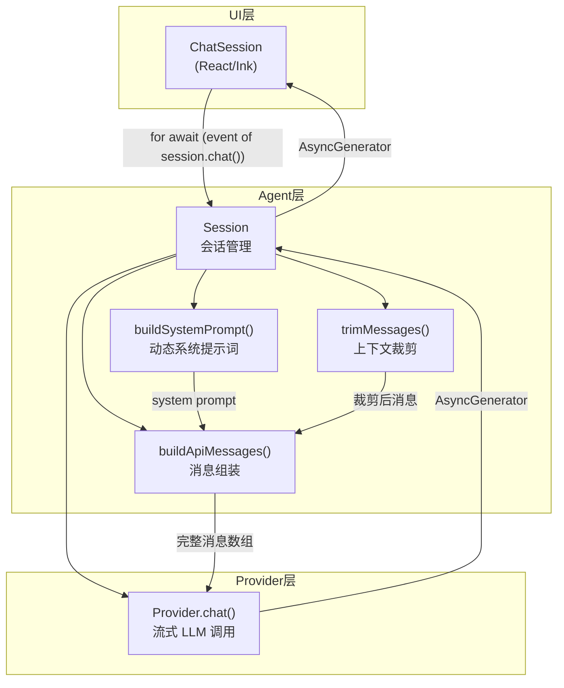
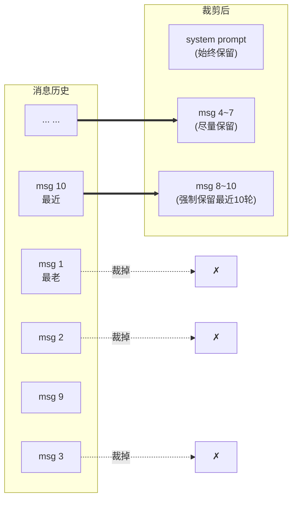
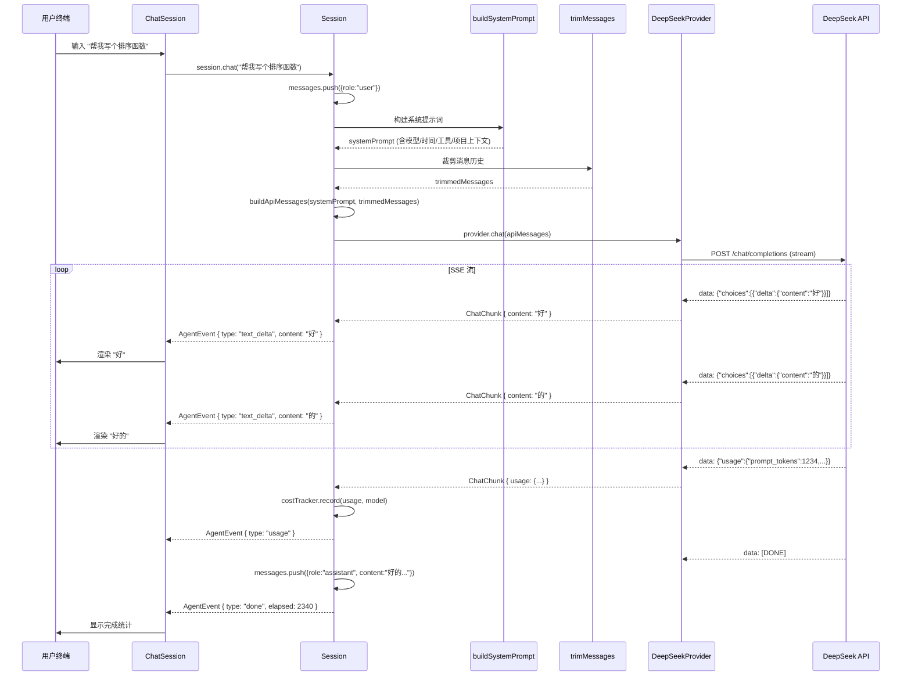

# Agent 主循环：消息编排与多轮对话

**TL;DR：** 一个 AI 编程助手的核心不是模型调用，而是"消息怎么组织、怎么裁剪、怎么在多轮对话中保持上下文"。本文拆解 dskcode 的 Agent Session — 从系统提示词动态构建、上下文窗口裁剪策略、到 AsyncGenerator 流式事件模型，讲清楚一个多轮对话引擎的完整实现。

---

## 问题在哪？

如果你只做一问一答，LLM 调用就是发个请求拿个响应，没什么好说的。但 AI 编程助手不一样：

| 问题 | 简单做法的后果 |
|------|---------------|
| 对话越聊越长，token 数超了 | API 直接报错 `context_length_exceeded` |
| 系统提示词每次都写死 | 换模型、加工具、改项目上下文全要改代码 |
| 工具调用结果要回传给模型 | 消息格式搞错，模型不知所云 |
| 用户 Ctrl+C 取消 | 请求挂在后台继续烧钱 |
| 多轮对话累积的成本 | 用户不知道花了多少钱 |

一句话：**Agent 不是"调一次 API"，而是一个有状态的消息编排引擎。**

## 架构总览



核心数据流：

1. 用户输入 → `Session.chat()` → 追加用户消息到历史
2. 构建系统提示词（动态，每轮都重新组装）
3. 裁剪消息历史（防止超出上下文窗口）
4. 组装 `[system, ...history]` 发给 Provider
5. 流式接收响应 → yield 事件给 UI 层
6. 将助手回复和工具结果追加到历史

## 消息类型系统

Agent 层的消息类型定义在 `src/agent/types.ts`：

```typescript
/** Agent 事件 — Session.chat() 流式输出的每一步 */
export type AgentEvent =
  | { type: "text_delta"; content: string }
  | { type: "tool_calls"; calls: ProviderToolCall[] }
  | { type: "usage"; usage: UsageInfo; model: string }
  | { type: "done"; elapsed: number }
  | { type: "error"; error: Error };

/** 会话状态：空闲 / 思考中 / 流式输出中 / 工具调用中 / 出错 */
export type SessionPhase =
  | "idle"
  | "thinking"
  | "streaming"
  | "tool_calling"
  | "error";
```

为什么用 **联合类型（discriminated union）** 而不是一个胖对象？

- 事件是互斥的：一个 chunk 要么是文本增量，要么是工具调用，要么是 usage 统计
- TypeScript 的类型收窄（`switch (event.type)`）让每个分支的形状都确定
- UI 层可以根据 `type` 决定渲染策略，不会访问到不存在的字段

消息角色遵循 OpenAI/DeepSeek 的标准四角色模型：

```typescript
type MessageRole = "system" | "user" | "assistant" | "tool";
```

| 角色 | 来源 | 说明 |
|------|------|------|
| `system` | `buildSystemPrompt()` 生成 | 每轮对话动态构建，始终在第一条 |
| `user` | 用户输入 | 终端里的那行文字 |
| `assistant` | 模型输出 | 可能包含文本 + 工具调用 |
| `tool` | 工具执行结果 | 对应之前的工具调用 ID |

## 系统提示词：动态组装，不是写死的字符串

很多项目的系统提示词是一个写死的常量。但 dskcode 的系统提示词每轮都要重新构建：

```typescript
// src/agent/system-prompt.ts
export function buildSystemPrompt(opts: SystemPromptOptions): string {
  const sections: string[] = [];

  // 1. 角色定义 — dskcode 是什么
  sections.push(`你是 dskcode，一个基于 DeepSeek 的 AI 编程助手...`);

  // 2. 模型信息 — 当前使用的模型
  sections.push(`## 当前模型\n- 模型：${opts.model}`);

  // 3. 时间上下文 — 当前日期时间 + 工作目录
  const now = new Date();
  sections.push(`## 时间上下文\n- 当前日期：${dateStr}\n- 当前时间：${timeStr}\n- 工作目录：${opts.cwd}`);

  // 4. 工具描述 — 可用工具列表（如有）
  if (opts.tools && opts.tools.length > 0) {
    sections.push(`## 可用工具\n${toolLines}\n调用工具时，请使用标准 function_call 格式。`);
  }

  // 5. 项目上下文 — AGENTS.md 内容（如有）
  if (opts.projectContext) {
    sections.push(`## 项目上下文\n${opts.projectContext}`);
  }

  // 6. 行为约束 — 安全边界
  sections.push(`## 行为约束\n- 不执行可能造成不可逆损害的操作...`);

  return sections.join("\n\n");
}
```

**为什么要动态？**

- **模型信息变了**：用户可能中途切换模型（Flash → Pro），系统提示词得马上跟上
- **工具列表变了**：后续章节加新工具时，系统提示词自动包含工具描述，不需要改 Agent 代码
- **项目上下文变了**：不同项目的 `AGENTS.md` 不同，`cwd` 也不同
- **时间变了**：模型得知道"今天"是哪天，否则无法正确回答涉及日期的问题

组装顺序有讲究：角色定义 → 模型信息 → 时间 → 工具 → 项目上下文 → 行为约束。角色定义和模型信息最关键，放最前面；工具和项目上下文是补充信息，居中；行为约束是底线，放最后形成"首因效应 + 近因效应"的双重锚定。

## 上下文裁剪：对话太长了怎么办？

DeepSeek V4 的上下文窗口是 100 万 token，听起来很大，但在编程助手里很快就不够用——一个项目的代码上下文 + 几十轮对话，轻松超限。

裁剪策略设计在 `src/agent/message-builder.ts`：

```typescript
export function trimMessages(
  messages: ChatMessage[],
  opts: TrimOptions,
): [ChatMessage[], boolean] {
  const meta = getModelMeta(opts.model);
  const maxInputTokens = meta.contextWindow - opts.reservedForOutput;

  // 系统提示词 token 估算（始终保留）
  const systemTokens = estimateTokens(opts.systemPrompt);
  let remaining = maxInputTokens - systemTokens;

  // 保留最近 N 轮（每轮 = user + assistant，或含 tool 消息的轮次）
  const preserved: ChatMessage[] = [];
  let roundsPreserved = 0;
  for (let i = messages.length - 1; i >= 0 && roundsPreserved < opts.preserveRecentRounds; i--) {
    preserved.unshift(messages[i]!);
    if (messages[i]!.role === "user") roundsPreserved++;
  }

  // 保证保留区不超限
  for (const msg of preserved) {
    remaining -= estimateMessageTokens(msg);
  }

  // 如果保留区本身已超限，从前面继续裁剪
  if (remaining < 0) {
    while (preserved.length > 1 && remaining < 0) {
      const removed = preserved.shift()!;
      remaining += estimateMessageTokens(removed);
    }
    return [preserved, true];
  }

  // 尝试填入更早的消息
  const olderMessages = messages.slice(0, messages.length - preserved.length);
  const kept: ChatMessage[] = [];
  for (let i = olderMessages.length - 1; i >= 0; i--) {
    const cost = estimateMessageTokens(olderMessages[i]!);
    if (remaining - cost < 0) break;
    remaining -= cost;
    kept.unshift(olderMessages[i]!);
  }

  const result = [...kept, ...preserved];
  const trimmed = result.length < messages.length;
  return [result, trimmed];
}
```

核心思路就三步：

1. **系统提示词始终保留**，不参与裁剪
2. **最近 N 轮强制保留**（默认 10 轮），这是对话的"工作记忆"
3. **更早的消息从最老的开始裁剪**，直到总 token 数不超过窗口



**Token 估算**怎么做？DeepSeek 没有提供在线 tokenizer，我们用经验公式：

```typescript
// src/provider/models.ts
function isCJK(char: string): boolean {
  const code = char.codePointAt(0)!;
  return (
    (code >= 0x4e00 && code <= 0x9fff) ||  // CJK 统一汉字
    (code >= 0x3400 && code <= 0x4dbf) ||  // CJK 扩展 A
    (code >= 0x20000 && code <= 0x2a6df) || // CJK 扩展 B
    (code >= 0xf900 && code <= 0xfaff) ||   // CJK 兼容汉字
    (code >= 0xff01 && code <= 0xff60)       // 全角字符
  );
}

export function estimateTokens(text: string): number {
  let cjkCount = 0, otherCount = 0;
  for (const char of text) {
    if (isCJK(char)) cjkCount++; else otherCount++;
  }
  // CJK: 1字符 ≈ 0.6 token, 其他: 1字符 ≈ 0.3 token
  return Math.max(1, Math.ceil(cjkCount * 0.6 + otherCount * 0.3));
}
```

中文字符比英文字符"贵"——1 个中文 ≈ 0.6 token，1 个英文 ≈ 0.3 token。这对编写中文编程助手的上下文裁剪至关重要。

## Agent 主循环：AsyncGenerator 事件模型

整个 Agent 的核心就是 `Session.chat()` 方法——它是一个 **AsyncGenerator**，逐步 yield 事件给调用方。

```typescript
// src/agent/index.ts
async *chat(userInput: string): AsyncGenerator<AgentEvent> {
  // 1. 追加用户消息
  this.#messages.push({ role: "user", content: userInput });

  // 2. 构建系统提示词
  const systemPrompt = this.#buildSystemPrompt();

  // 3. 裁剪消息历史以适应上下文窗口
  const [trimmed, wasTrimmed] = trimMessages([...this.#messages], {
    model: this.#provider.model() as ModelId,
    reservedForOutput: this.#options.reservedForOutput,
    systemPrompt,
    preserveRecentRounds: this.#options.preserveRecentRounds,
  });

  // 4. 组装 API 请求：[system, ...history]
  const apiMessages = buildApiMessages(systemPrompt, trimmed);
  const toolDefs = this.#buildToolDefinitions();
  const startTime = Date.now();

  try {
    // 5. 调用 Provider 流式接口
    const stream = this.#provider.chat(apiMessages, {
      signal: this.#abortController.signal,
    });

    // 6. 逐步解析流式响应
    let accumulatedText = "";
    let lastUsage: UsageInfo | undefined;
    let lastToolCalls: ProviderToolCall[] | undefined;

    for await (const chunk of stream) {
      if (chunk.content) {
        accumulatedText += chunk.content;
        yield { type: "text_delta", content: chunk.content };  // 👈 即时输出
      }

      if (chunk.toolCalls && chunk.toolCalls.length > 0) {
        lastToolCalls = chunk.toolCalls;  // 累积，不立即 yield
      }

      if (chunk.usage) {
        lastUsage = chunk.usage;
      }
    }

    // 7. 流结束后，一次性发出完整事件
    if (lastToolCalls && lastToolCalls.length > 0) {
      yield { type: "tool_calls", calls: lastToolCalls };
    }

    if (lastUsage) {
      const costInfo = this.#costTracker.record(lastUsage, modelId);
      yield { type: "usage", usage: lastUsage, model: modelId };
    }

    // 8. 追加助手消息到历史
    const assistantMsg: ChatMessage = {
      role: "assistant",
      content: accumulatedText,
    };
    if (lastToolCalls && lastToolCalls.length > 0) {
      assistantMsg.toolCalls = lastToolCalls;
    }
    this.#messages.push(assistantMsg);

    // 9. 工具调用占位（后续章节实现实际执行）
    if (lastToolCalls && lastToolCalls.length > 0) {
      for (const tc of lastToolCalls) {
        this.#messages.push({
          role: "tool",
          content: `⚠ 工具 "${tc.name}" 等待执行`,
          toolCallId: tc.id,
          name: tc.name,
        });
      }
    }

    // 10. 本轮完成
    yield { type: "done", elapsed: Date.now() - startTime };
  } catch (err: unknown) {
    if (err instanceof Error && err.name === "AbortError") return;
    yield {
      type: "error",
      error: err instanceof Error ? err : new Error(String(err)),
    };
  }
}
```

为什么选择 **AsyncGenerator** 而不是 Promise 或回调？

| 方案 | 优点 | 缺点 |
|------|------|------|
| `Promise<string>` | 最简单 | 无法流式输出，用户体验差 |
| `(event) => void` 回调 | 可以流式 | 回调地狱，难以组合和控制 |
| `EventEmitter` | 灵活 | 类型不安全，内存泄漏风险 |
| **AsyncGenerator** | 流式 + 类型安全 + 可取消 | 调用方必须 `for await` |

AsyncGenerator 是唯一"既能流式、又有类型安全、还支持取消"的方案。UI 层用 `for await...of` 消费，用 `AbortController` 取消——干净利落。

### 事件流转的设计考量

注意工具调用和文本内容的事件策略不同：

- **文本增量 `text_delta`**：逐块立即 yield，UI 层可以做到逐字渲染
- **工具调用 `tool_calls`**：流结束后一次性 yield 完整列表

为什么不逐块 yield 工具调用？因为 DeepSeek 的 SSE 流中，一个工具调用可能跨 3~5 个数据块到达：

```
块1: tool_calls: [{ index: 0, id: "call_abc", function: { name: "bash" } }]
块2: tool_calls: [{ index: 0, function: { arguments: '{"com' } }]
块3: tool_calls: [{ index: 0, function: { arguments: 'mand": "ls"}' } }]
块4: finish_reason: "tool_calls"
```

参数是逐步拼接的。如果中间 yield 半成品，UI 层拿到的 JSON 是残缺的，没法解析。所以在 Provider 层用 `AccumulatedToolCall` Map 做跨块累积，流结束后一次吐出。

## 消息组装：从历史到 API 请求

```typescript
// src/agent/message-builder.ts
export function buildApiMessages(
  systemPrompt: string,
  history: ChatMessage[],
): ChatMessage[] {
  return [
    { role: "system", content: systemPrompt },
    ...history,
  ];
}
```

就这一行代码？对，就是这么简单。但 `buildApiMessages` 之前的那步——`trimMessages`——才是重头戏。

整个消息编排的数据流：

```
用户输入
  │
  ▼
messages.push({ role: "user", content: input })
  │
  ▼
buildSystemPrompt()     ─── 动态组装系统提示词
  │
  ▼
trimMessages()          ─── 裁剪到上下文窗口内
  │
  ▼
buildApiMessages()      ─── [system, ...trimmed_history]
  │
  ▼
provider.chat()         ─── 流式调用 LLM
  │
  ▼
逐块 parse stream ─── yield AgentEvent
  │
  ▼
messages.push(assistantMsg) ─── 写入历史
messages.push(toolMsg)   ─── 工具结果入历史（占位）
```

## UI 层的消费方式

在 `ChatSession.tsx` 里，UI 层这样消费 Agent 事件：

```typescript
// src/ui/ChatSession.tsx
const handleSubmit = useCallback(async (value: string) => {
  // ...省略输入验证和斜杠命令处理

  setIsStreaming(true);
  setCurrentContent("");
  setCurrentToolCalls([]);
  const abortController = new AbortController();
  abortRef.current = abortController;

  try {
    for await (const event of session!.chat(trimmed)) {
      if (abortController.signal.aborted) break;

      switch (event.type) {
        case "text_delta":
          setCurrentContent((prev) => prev + event.content);
          break;
        case "tool_calls":
          setCurrentToolCalls((prev) => [...prev, ...event.calls]);
          break;
        case "usage":
          setCurrentUsage(event.usage);
          setCurrentModel(event.model);
          break;
        case "done":
          setCurrentElapsed(event.elapsed);
          break;
        case "error":
          setStreamError(event.error.message);
          break;
      }
    }
  } catch (err) {
    setStreamError(err.message);
  } finally {
    setIsStreaming(false);
  }
}, [...]);
```

每个 `AgentEvent.type` 直接映射到一个 React state 更新——类型安全，没有魔法字符串，不会漏处理。

**Ctrl+C 取消**的实现也很干净：

```typescript
useInput(useCallback((_input, key) => {
  if (key.ctrl && _input === "c") {
    if (isStreaming) {
      abortRef.current?.abort();  // 取消进行中的请求
    } else {
      handleCtrlC();  // 退出程序
    }
  }
}, [isStreaming, handleCtrlC]));
```

`Session` 本身也有 `abort()` 方法，内部通过 `AbortController` 信号传递给 Provider 的 `fetch` 请求——从用户按键到网络连接断开，全链路可取消。

## 会话管理

```typescript
export class Session {
  readonly #messages: ChatMessage[] = [];   // 消息历史（内存中）
  readonly #provider: Provider;              // LLM Provider
  readonly #tools: Tool[];                   // 注册的工具列表
  readonly #costTracker: CostTracker;        // 成本追踪器
  readonly #abortController = new AbortController();

  // 可配置选项
  readonly #options: {
    cwd: string;                   // 工作目录
    maxToolRounds: number;         // 最大工具调用轮次（防循环）
    reservedForOutput: number;     // 为输出预留的 token 数
    preserveRecentRounds: number;  // 强制保留最近 N 轮对话
    projectContext?: string;       // AGENTS.md 内容
  };

  /** 重置会话历史（保留配置，重置成本追踪） */
  reset(): void {
    this.#messages.length = 0;
    this.#costTracker.resetSession();
  }

  /** 取消正在进行的流式请求 */
  abort(): void {
    this.#abortController.abort();
  }
}
```

几个设计决策：

- **消息用数组维护**：对话历史就是消息的有序数组，不需要更复杂的数据结构
- **`maxToolRounds` 默认 20**：防止 agent 陷入"调工具 → 结果不对 → 再调工具"的无限循环
- **`reservedForOutput` 默认 4096**：给模型输出留够 token，输入历史不能把上下文窗口全占满
- **`reset()` 只清消息和 session 成本**：不重置日级统计——"今天花了多少钱"应该跨会话保留

## 完整流水线：从用户回车到终端输出



## 测试覆盖

| 模块 | 测试要点 | 关键断言 |
|------|---------|---------|
| `buildSystemPrompt` | 各段拼接、空工具列表、空项目上下文 | 包含模型名、包含工具描述、包含项目上下文 |
| `trimMessages` | 不超限、超限时从最老裁剪、保留区本身超限回退 | 裁剪后长度 ≤ 原始、最近消息保留、系统提示词不计入 |
| `buildApiMessages` | 系统消息始终在第一条 | 第一个消息的 role 为 "system" |
| `estimateTokens` | 纯英文、纯中文、中英混合 | 估算值在合理范围内 |
| `Session.chat` | 文本流式、工具调用、取消、错误 | 事件类型序列、累积文本正确 |

## Trade-offs 与反思

### 做得对的决定

- **AsyncGenerator 作为 Agent 核心原语**：流式 + 可取消 + 类型安全，三样全占了
- **系统提示词动态构建**：换模型、加工具、改项目全都不用改 Agent 代码
- **保留最近 N 轮强制策略**：比起"平均裁剪"，保留最近对话对编程助手更重要——用户当前的问题最重要
- **CostTracker 和 Session 耦合度低**：成本追踪可以独立使用，也可以注入到 Session

### 可以更好的地方

- **Token 估算是经验公式**：没有用 DeepSeek 的在线 tokenizer，估算会有偏差。上下文裁剪时留了 `reservedForOutput` 的缓冲区，但极端情况（超长代码块）仍可能不够精确
- **工具调用结果是占位消息**：代码注释里写了"第08章将改为实际执行"，目前工具调用入历史但还没执行
- **没有消息压缩**：当对话很长时，直接裁剪老消息会丢失上下文。更好的做法是对老消息做摘要压缩，但那需要额外的 LLM 调用
- **单 AbortController**：每次 `chat()` 应该创建新的 AbortController，而不是复用 Session 级别的。当前实现中 `abort()` 调用的是 Session 的 `#abortController`，多轮并发时会出问题

## 小结

| 完成项 | 说明 |
|--------|------|
| ✅ Agent 事件类型 | `AgentEvent` 联合类型，5 种事件覆盖流式输出全场景 |
| ✅ 系统提示词动态构建 | 6 段组装：角色→模型→时间→工具→项目→约束 |
| ✅ 上下文裁剪 | 保留最近 N 轮 + 从最老裁剪 + 系统提示词始终保留 |
| ✅ AsyncGenerator 主循环 | `Session.chat()` 逐步 yield 事件，UI 层 for-await 消费 |
| ✅ 工具调用累积 | 跨 SSE 块拼接工具调用参数，流结束一次性 yield |
| ✅ 成本追踪集成 | 每轮调用后自动记录 usage 和费用 |
| ✅ 取消机制 | AbortController 全链路可取消 |

下一个章节将实现 **工具执行系统** — 把占位的 `⚠ 工具等待执行` 替换为真正的工具调用和结果回传。

## 延伸阅读

- [OpenAI Chat Completions API — Streaming](https://platform.openai.com/docs/api-reference/chat/create)
- [DeepSeek API Documentation](https://api-docs.deepseek.com/)
- [AsyncGenerator — MDN](https://developer.mozilla.org/en-US/docs/Web/JavaScript/Reference/Global_Objects/AsyncGenerator)
- [AbortController — MDN](https://developer.mozilla.org/en-US/docs/Web/API/AbortController)
- [dskcode 源码 — agent/index.ts](../src/agent/index.ts)