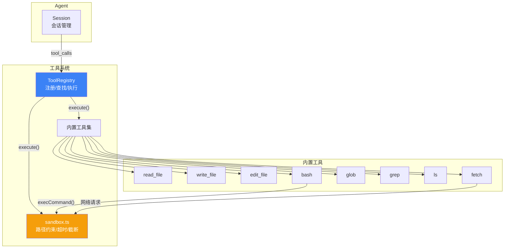

# 工具系统：内置工具的设计与注册

**TL;DR：** Agent 的能力边界取决于它能调用什么工具。本文拆解 dskcode 的工具系统——从 `Tool` 接口设计、`ToolRegistry` 注册表模式、8 个内置工具的实现细节，到工具执行沙箱和 Agent 主循环的集成。读完你会理解一个类型安全、可扩展、带超时保护和输出截断的工具系统是怎么从零搭起来的。

---

## 为什么 Agent 需要工具？

没有工具的 LLM，就是一个只会说话的脑子。你问它"帮我看看日志里有没有 Error"，它只能说"请你把日志贴出来"。

有了工具就不一样了——模型可以自己 `read_file` 读代码，`bash` 跑命令，`grep` 搜关键词，`edit_file` 改代码，`fetch` 查文档。Agent 从"被动应答"变成"主动操作"。

| 操作 | 没有工具 | 有工具 |
|------|----------|--------|
| 查文件内容 | 用户手动贴代码 | `read_file` 一次搞定 |
| 搜索代码 | 用户描述位置 | `grep`/`glob` 精准定位 |
| 运行命令 | 用户复制粘贴 | `bash` 直接执行 |
| 修改代码 | 用户手动改 | `edit_file` 精确替换 |
| 网络请求 | 用户复制 JSON | `fetch` 帮你请求 |

一句话：**工具是 Agent 的手和眼，没工具就是嘴强王者。**

## 架构总览



整个工具系统由以下模块组成：

| 模块 | 文件 | 职责 |
|------|------|------|
| 核心类型 | `types.ts` | `Tool`、`ToolContext`、`ToolResult` 接口 |
| 注册表 | `registry.ts` | 注册/查找/列出/禁用/执行工具 |
| 沙箱 | `sandbox.ts` | 路径解析、超时控制、输出截断、命令执行 |
| 内置工具 | `builtins/*.ts` | 8 个具体工具实现 |
| 聚合导出 | `index.ts` | 公共 API 统一导出 |

## 第一步：定义 Tool 接口

所有工具都遵循同一个接口：

```typescript
// src/tool/types.ts

/** 每次工具执行时传入的上下文 */
export interface ToolContext {
  /** 当前工作目录，用于路径约束和相对路径解析 */
  cwd: string;
  /** 中止信号，用于取消正在执行的工具 */
  signal?: AbortSignal;
  /** 命令执行超时（毫秒），默认 30000 */
  timeout?: number;
}

/** 工具执行返回的结果 */
export interface ToolResult {
  /** 是否执行成功 */
  success: boolean;
  /** 结果内容（成功时为输出，失败时为错误信息） */
  data: string;
  /** 错误详情（仅在 success=false 时有意义） */
  error?: string;
}

/** Tool 接口 — 每个内置工具或插件适配的工具都需要实现此接口 */
export interface Tool {
  /** 工具名称，全局唯一标识符 */
  readonly name: string;
  /** 工具描述，供模型理解工具的功能和用法 */
  readonly description: string;
  /** 参数的 JSON Schema 定义，供模型理解输入格式 */
  readonly parameters: JSONSchema;
  /** 执行工具逻辑 */
  execute(args: unknown, ctx: ToolContext): Promise<ToolResult>;
}
```

这个设计有三个关键决策：

1. **`execute` 返回 `Promise<ToolResult>` 而不是抛异常**：工具调用天然可能失败——文件不存在、命令超时、权限不足。用 `success` + `error` 字段比 `try/catch` 更适合 Agent 场景，因为 Agent 需要根据错误类型决定下一步：重试？换工具？告诉用户？

2. **`args` 用 `unknown` 而不是泛型**：JSON 解析出来的参数类型在运行时才能确定，泛型在这里给不了真正的类型安全。每个工具在自己的 `execute` 里做参数校验和类型断言就好。

3. **`ToolContext` 包含 `cwd` + `signal` + `timeout`**：`cwd` 让所有路径解析都基于工作目录，`signal` 让用户 Ctrl+C 时能真正中断工具执行，`timeout` 防止命令跑飞。

## 第二步：ToolRegistry — 注册、查找、禁用、执行

### 为什么用注册表模式？

最直觉的做法是维护一个工具数组 `tools: Tool[]`，然后 `tools.find(t => t.name === name)`。但实际场景有几个需求：

- **按名称查找**：Agent 收到模型的 `tool_calls` 后，需要按名字找到对应工具
- **禁用工具**：用户可能不想让 Agent 执行 `bash`，需要运行时开关
- **去重检查**：同一个工具被注册两次会产生歧义
- **统一执行入口**：执行失败时统一兜底，不让异常跑到 Agent 循环外

所以我选了 `Map<string, Tool>` + `Set<string>` 的组合：

```typescript
// src/tool/registry.ts

export class ToolRegistry {
  readonly #tools = new Map<string, Tool>();
  readonly #disabledNames: Set<string>;

  constructor(opts?: ToolRegistryOptions) {
    this.#disabledNames = new Set(opts?.disabledTools ?? []);
  }

  /** 注册一个工具，同名则抛错 */
  register(tool: Tool): this {
    if (this.#tools.has(tool.name)) {
      throw new Error(`工具 "${tool.name}" 已注册，不能重复注册`);
    }
    this.#tools.set(tool.name, tool);
    return this;
  }

  /** 按名称获取工具，被禁用的返回 undefined */
  get(name: string): Tool | undefined {
    if (this.#disabledNames.has(name)) return undefined;
    return this.#tools.get(name);
  }

  /** 获取所有启用的工具 */
  list(): Tool[] {
    const result: Tool[] = [];
    for (const [name, tool] of this.#tools) {
      if (!this.#disabledNames.has(name)) result.push(tool);
    }
    return result;
  }

  /** 统一执行入口 — 找不到或出错都返回 ToolResult */
  async execute(name: string, args: unknown, ctx: ToolContext): Promise<ToolResult> {
    const tool = this.get(name);
    if (!tool) {
      return {
        success: false,
        data: `工具 "${name}" 不存在或已被禁用`,
        error: "TOOL_NOT_FOUND",
      };
    }
    try {
      return await tool.execute(args, ctx);
    } catch (err: unknown) {
      const message = err instanceof Error ? err.message : String(err);
      return {
        success: false,
        data: `工具 "${name}" 执行异常：${message}`,
        error: "EXECUTION_ERROR",
      };
    }
  }

  // ... disable/enable/unregister/names/has/isEnabled 省略
}
```

几个设计细节：

- **`register` 返回 `this`**：支持链式调用 `registry.register(toolA).register(toolB)`
- **`get` 对禁用工具返回 `undefined`**：调用方不需要先检查 `isEnabled` 再 `get`，一步到位
- **`execute` 是安全网**：即使工具代码内部抛了未预期的异常，也不会把 Agent 主循环搞崩，而是返回一个 `success: false` 的 `ToolResult`
- **私有字段用 `#`**：JavaScript 真正的私有字段，不是 TypeScript 的 `private` 运行时还能访问

### 批量注册

内置工具一注册就是 8 个，逐个 `register` 太啰嗦。`registerAll` 加上聚合导出让事情变简单：

```typescript
// src/tool/builtins/index.ts

import { readFileTool } from "./read-file.js";
import { writeFileTool } from "./write-file.js";
import { editFileTool } from "./edit-file.js";
import { bashTool } from "./bash.js";
import { globTool } from "./glob.js";
import { grepTool } from "./grep.js";
import { lsTool } from "./ls.js";
import { fetchTool } from "./fetch.js";

export const builtinTools: Tool[] = [
  readFileTool,
  writeFileTool,
  editFileTool,
  bashTool,
  globTool,
  grepTool,
  lsTool,
  fetchTool,
];

export function getBuiltinToolMap(): Map<string, Tool> {
  return new Map(builtinTools.map((t) => [t.name, t]));
}
```

使用时一行搞定：

```typescript
const registry = new ToolRegistry();
registry.registerAll(builtinTools);
```

## 第三步：内置工具逐一拆解

8 个工具，4 种类型：

| 类型 | 工具 | 核心能力 |
|------|------|----------|
| 文件读写 | `read_file`、`write_file`、`edit_file` | 读取、创建、精确替换 |
| 命令执行 | `bash` | shell 命令，超时 + 截断 |
| 文件搜索 | `glob`、`grep`、`ls` | 模式匹配、内容搜索、目录列表 |
| 网络请求 | `fetch` | HTTP GET/POST，响应截断 |

### read_file — 按行号读文件

```typescript
export const readFileTool: Tool = {
  name: "read_file",
  description: "读取指定路径的文件内容。支持行号范围选择，输出带行号。",
  parameters: readFileSchema,

  async execute(args: unknown, ctx: ToolContext): Promise<ToolResult> {
    const params = args as ReadFileArgs;
    // 参数校验...
    const filePath = resolvePath(params.path, ctx.cwd);

    // 检查文件大小（防炸内存）
    const fileStat = await stat(filePath);
    if (fileStat.size > 10 * 1024 * 1024) {
      return { success: false, data: "文件过大，超过 10MB 限制", error: "FILE_TOO_LARGE" };
    }

    const content = await readFile(filePath, "utf-8");
    const lines = content.split("\n");

    // 行号范围（1-based → 0-based）
    const startLine = Math.max(1, params.start_line ?? 1) - 1;
    const endLine = params.end_line ? Math.min(params.end_line, lines.length) : lines.length;
    const selectedLines = lines.slice(startLine, endLine);

    // 添加行号前缀： " 12 | const x = 1"
    const lineNumWidth = String(endLine).length;
    const result = selectedLines
      .map((line, i) => {
        const lineNum = String(startLine + i + 1).padStart(lineNumWidth, " ");
        return `${lineNum} | ${line}`;
      })
      .join("\n");

    return { success: true, data: truncateOutput(result) };
  },
};
```

两个关键决策：

1. **10MB 文件大小限制**：Agent 读文件不是人看文件，一个 500MB 的日志文件塞进上下文窗口直接爆掉。`10MB` 是合理的上限。
2. **行号前缀**：模型读代码不带行号就像人在没有坐标系的地图上找路，后续 `edit_file` 需要行号来定位。

### write_file — 创建或覆盖文件

```typescript
export const writeFileTool: Tool = {
  name: "write_file",
  description: "创建或覆盖文件。如果父目录不存在会自动创建。",
  parameters: writeFileSchema,

  async execute(args: unknown, ctx: ToolContext): Promise<ToolResult> {
    const params = args as WriteFileArgs;
    const filePath = resolvePath(params.path, ctx.cwd);
    // 自动创建中间目录
    await mkdir(dirname(filePath), { recursive: true });
    const content = String(params.content);
    await writeFile(filePath, content, "utf-8");

    const lineCount = content.split("\n").length;
    const byteSize = Buffer.byteLength(content, "utf-8");
    return { success: true, data: `文件已写入：${filePath}（${lineCount} 行，${byteSize} 字节）` };
  },
};
```

`mkdir(dirname(filePath), { recursive: true })` — 一个细节：如果 Agent 要写 `src/new-module/index.ts` 而 `new-module` 目录不存在，`recursive: true` 会自动创建，体验丝滑。

### edit_file — 精确字符串替换

这是最值得细看的工具，因为它的设计直接影响了 Agent 修改代码的安全性和准确性。

```typescript
export const editFileTool: Tool = {
  name: "edit_file",
  description: "对文件进行精确字符串替换。查找文件中的 old_text 并替换为 new_text。",
  parameters: editFileSchema,

  async execute(args: unknown, ctx: ToolContext): Promise<ToolResult> {
    const params = args as EditFileArgs;
    const filePath = resolvePath(params.path, ctx.cwd);
    const content = await readFile(filePath, "utf-8");

    // 检查 old_text 是否存在
    const firstIndex = content.indexOf(params.old_text);
    if (firstIndex === -1) {
      return { success: false, data: "未找到要替换的文本", error: "TEXT_NOT_FOUND" };
    }

    // 检查是否出现多次 — 防止误改
    const secondIndex = content.indexOf(params.old_text, firstIndex + 1);
    if (secondIndex !== -1) {
      return { success: false, data: "要替换的文本在文件中出现多次，请提供更多上下文", error: "TEXT_MULTIPLE_MATCHES" };
    }

    // 只替换第一处
    const newContent = content.replace(params.old_text, params.new_text);
    await writeFile(filePath, newContent, "utf-8");

    // 报告行号信息
    const startLine = content.slice(0, firstIndex).split("\n").length;
    return { success: true, data: `文件已编辑：${filePath}\n替换位置：第 ${startLine} 行` };
  },
};
```

为什么用精确字符串替换而不是"替换第 N 行"？

- 模型生成 `old_text` 时已经对要改什么做了明确判断，这比行号更精确
- 行号会随着文件变化漂移，而字符串匹配是"内容锚定"的
- 唯一性检查（`TEXT_MULTIPLE_MATCHES`）强制模型提供足够的上下文，防止误改

这三个错误码各有意味：

| 错误码 | 场景 | 模型的下一步 |
|--------|------|-------------|
| `TEXT_NOT_FOUND` | `old_text` 写错了或文件被改动 | 重新 `read_file` 确认内容 |
| `TEXT_MULTIPLE_MATCHES` | 匹配到多处，无法确定改哪 | 扩大上下文让匹配唯一 |
| `EDIT_ERROR` | 权限、磁盘等系统错误 | 告知用户 |

### bash — 执行 shell 命令

```typescript
export const bashTool: Tool = {
  name: "bash",
  description: "在 shell 中执行命令。返回标准输出、标准错误和退出码。",
  parameters: bashSchema,

  async execute(args: unknown, ctx: ToolContext): Promise<ToolResult> {
    const params = args as BashArgs;
    const timeout = params.timeout ?? ctx.timeout ?? getDefaultTimeout();

    const result = await execCommand("sh", ["-c", params.command], ctx.cwd, timeout, ctx.signal);

    const parts: string[] = [];
    if (result.stdout) parts.push(truncateOutput(result.stdout));
    if (result.stderr) parts.push(`[stderr]\n${truncateOutput(result.stderr)}`);

    const success = result.exitCode === 0;
    return {
      success,
      data: `${parts.join("\n")}\n[退出码: ${result.exitCode ?? "未知"}]`,
      error: success ? undefined : `EXIT_CODE_${result.exitCode ?? "UNKNOWN"}`,
    };
  },
};
```

bash 是最"危险"的工具，所以它的安全措施也最多：

- **超时控制**：默认 30 秒，可配置
- **输出截断**：默认 50K 字符，防 `find / -type f` 炸输出
- **退出码报告**：让模型知道命令是否成功
- **stderr 分离**：`[stderr]` 前缀让模型区分正常输出和错误信息

### glob — 文件模式匹配搜索

```typescript
// 核心：将 glob 模式转为正则
function globToRegex(pattern: string): RegExp {
  let regexStr = pattern;
  // 先处理 **，再处理 *，顺序很重要
  regexStr = regexStr.replace(/\*\*\//g, "<<GLOBSTAR_SLASH>>");
  regexStr = regexStr.replace(/\*\*/g, "<<GLOBSTAR>>");
  regexStr = regexStr.replace(/\?/g, "<<QUESTION>>");
  regexStr = regexStr.replace(/[.+^${}()|[\]\\]/g, "\\$&");
  regexStr = regexStr.replace(/\*/g, "[^/]*");        // * → 非路径分隔符
  regexStr = regexStr.replace(/<<GLOBSTAR_SLASH>>/g, "(.*/)?");  // **/ → 零或多层目录
  regexStr = regexStr.replace(/<<GLOBSTAR>>/g, ".*");  // ** → 任意路径
  regexStr = regexStr.replace(/<<QUESTION>>/g, "[^/]"); // ? → 单个非路径分隔符
  return new RegExp(`^${regexStr}$`, "i");
}
```

没有依赖 `glob` 或 `minimatch` 包，自己写了模式转换。原因：

- 项目最小依赖原则：能自己写的就不加包
- Agency 场景的 glob 模式通常不复杂：`**/*.ts`、`src/**/*.test.ts`
- 自动跳过 `node_modules` 和 `.git`，这是 Agent 搜索的刚需

### grep — 正则内容搜索

```typescript
export const grepTool: Tool = {
  name: "grep",
  description: "在文件内容中搜索正则表达式。返回匹配行的文件路径、行号和内容。",
  parameters: grepSchema,

  async execute(args: unknown, ctx: ToolContext): Promise<ToolResult> {
    // 编译正则
    const flags = params.case_sensitive ? "g" : "gi";
    const regex = new RegExp(params.pattern, flags);

    // 递归收集文件（跳过 node_modules/.git/dist）
    const files = await collectFiles(searchDir, searchDir, params.include, maxFiles);

    // 逐文件逐行搜索
    for (const filePath of files) {
      const content = await readFile(filePath, "utf-8");
      const lines = content.split("\n");
      for (let i = 0; i < lines.length; i++) {
        if (regex.test(lines[i]!)) {
          regex.lastIndex = 0;  // g 标志需要重置
          matches.push({ file: relPath, line: i + 1, content: lines[i]! });
          if (matches.length >= 500) break;
        }
      }
    }

    // 格式化输出： "src/index.ts:42: const x = 1"
    const output = matches.map((m) => `${m.file}:${m.line}: ${m.content}`).join("\n");
    return { success: true, data: truncateOutput(output) };
  },
};
```

输出格式刻意和 `grep -n` 保持一致（`file:line: content`），模型训练数据里充斥这种格式，用它能更好地理解搜索结果。

### ls — 目录列表

```typescript
export const lsTool: Tool = {
  name: "ls",
  description: "列出目录内容。显示条目类型和大小。",
  parameters: lsSchema,

  async execute(args: unknown, ctx: ToolContext): Promise<ToolResult> {
    const entries = await readdir(dirPath, { withFileTypes: true });
    // 按类型排序：目录在前，文件在后
    const sorted = [...entries].sort((a, b) => {
      if (a.isDirectory() !== b.isDirectory()) return a.isDirectory() ? -1 : 1;
      return a.name.localeCompare(b.name);
    });

    for (const entry of sorted) {
      const typeLabel = entry.isDirectory() ? "📁" : entry.isSymbolicLink() ? "🔗" : "📄";
      lines.push(`${typeLabel} ${entry.name}${sizeStr ? ` (${sizeStr})` : ""}`);
    }

    return { success: true, data: truncateOutput(`目录：${dirPath}\n${lines.join("\n")}`) };
  },
};
```

文件夹在前文件在后，加 emoji 标记类型——为了模型一眼看清哪些是目录。文件大小自动格式化为 `B`/`KB`/`MB`。

### fetch — HTTP 请求

```typescript
export const fetchTool: Tool = {
  name: "fetch",
  description: "发起 HTTP 请求并返回响应内容。支持自定义方法和请求头。",
  parameters: fetchSchema,

  async execute(args: unknown, ctx: ToolContext): Promise<ToolResult> {
    const response = await fetch(params.url, fetchOptions);
    const body = await response.text();
    const truncatedBody = truncateOutput(body, maxLength);

    return {
      success: response.ok,
      data: `状态: ${response.status} ${response.statusText}\n内容类型: ${contentType}\n---\n${truncatedBody}`,
      error: response.ok ? undefined : `HTTP_${response.status}`,
    };
  },
};
```

`fetch` 用 Node 18+ 原生 `fetch`，不引入额外依赖。超时用 `AbortSignal.timeout()`，干净利落。

## 第四步：沙箱 — 安全护栏

工具直接操作文件系统和命令行，不设防就是裸奔。`sandbox.ts` 提供了三层保护：

```typescript
// src/tool/sandbox.ts — 关键函数

/** 路径解析：相对路径 → 绝对路径，防止路径逃逸 */
export function resolvePath(inputPath: string, cwd: string): string {
  const resolved = isAbsolute(inputPath) ? inputPath : resolve(cwd, inputPath);
  return resolve(resolved);  // normalize 去掉 .. 和 .
}

/** 输出截断：防止巨大输出塞爆上下文窗口 */
export function truncateOutput(content: string, maxLength = 50_000): string {
  if (content.length <= maxLength) return content;
  return `${content.slice(0, maxLength)}\n\n... [输出过长，已截断，共 ${content.length} 字符]`;
}

/** 创建超时信号：超时自动 abort，外部信号也能联动 */
export function createTimeoutSignal(signal?: AbortSignal, timeoutMs = 30_000): AbortController {
  const controller = new AbortController();
  if (signal) signal.addEventListener("abort", () => controller.abort(), { once: true });
  const timer = setTimeout(() => controller.abort(), timeoutMs);
  controller.signal.addEventListener("abort", () => clearTimeout(timer), { once: true });
  return controller;
}
```

三道防线各防什么：

| 防线 | 威胁 | 措施 |
|------|------|------|
| 路径解析 | `../../etc/passwd` 路径穿越 | `resolve()` 归一化，`relative()` 检查是否逃逸 |
| 输出截断 | `cat /dev/urandom` 或超大日志 | 默认 50K 字符上限，超出截断加提示 |
| 超时控制 | `while true; do :; done` 无限循环 | 30 秒超时 + 外部 `AbortSignal` 联动 |

`execCommand` 是 bash 工具的底层，处理了 Windows/Linux 差异：

```typescript
export async function execCommand(
  command: string, args: string[], cwd: string,
  timeoutMs = 30_000, signal?: AbortSignal,
): Promise<{ stdout: string; stderr: string; exitCode: number | null }> {
  // Windows 用 cmd.exe，其他平台用 /bin/sh
  const spawnCmd = isWindows ? "cmd" : command;
  const spawnArgs = isWindows ? ["/c", command, ...args] : args;

  const child = spawn(spawnCmd, spawnArgs, { cwd, shell: !isWindows, ... });

  // 超时后先 SIGTERM，5 秒后 SIGKILL
  const timeout = setTimeout(() => {
    child.kill("SIGTERM");
    setTimeout(() => child.kill("SIGKILL"), 5000);
  }, timeoutMs);

  // 外部中止信号联动
  if (signal) signal.addEventListener("abort", () => child.kill("SIGTERM"), { once: true });
}
```

## 第五步：Agent 主循环集成

工具不是孤立存在的，它要嵌入 Agent 的对话循环。此次改动把原来占位的 `"工具系统将在第08章实现"` 替换成真实的工具执行逻辑。

### 改动前的 Agent 循环

```typescript
// 改动前：简单追加占位消息
if (lastToolCalls && lastToolCalls.length > 0) {
  for (const tc of lastToolCalls) {
    this.#messages.push({
      role: "tool",
      content: `⚠ 工具 "${tc.name}" 等待执行（工具系统将在第08章实现）`,
      toolCallId: tc.id,
      name: tc.name,
    });
  }
}
```

### 改动后的 Agent 循环

```typescript
// 改动后：工具执行 → 结果回传 → 继续循环
while (toolRounds < this.#options.maxToolRounds) {
  // a. 构建消息 + 调用 LLM
  const stream = this.#provider.chat(apiMessages, { signal, tools: toolDefs });

  // b. 解析响应
  for await (const chunk of stream) { ... }

  // c. 追加助手消息
  this.#messages.push(assistantMsg);

  // d. 如果有工具调用，执行工具并继续循环
  if (lastToolCalls && lastToolCalls.length > 0) {
    yield { type: "tool_calls", calls: lastToolCalls };

    for (const tc of lastToolCalls) {
      let toolArgs: unknown;
      try { toolArgs = tc.arguments ? JSON.parse(tc.arguments) : {}; }
      catch { toolArgs = {}; }

      const result = await this.#toolRegistry.execute(tc.name, toolArgs, toolCtx);
      yield { type: "tool_result", name: tc.name, result };

      this.#messages.push({
        role: "tool",
        content: result.data,
        toolCallId: tc.id,
        name: tc.name,
      });
    }

    toolRounds++;  // 继续循环，让模型基于工具结果生成回答
    continue;
  }

  // 没有工具调用，退出循环
  break;
}
```

关键变化：

| 改动点 | 改动前 | 改动后 |
|--------|--------|--------|
| 工具存储 | `Tool[]` 数组 | `ToolRegistry` 注册表 |
| 工具执行 | 占位消息 `⚠ 等待实现` | 真实执行 + 结果回传 |
| 循环结构 | 执行一次就结束 | `while` 循环，工具结果驱动继续 |
| 事件类型 | `tool_calls` 一种 | 新增 `tool_result` 事件 |
| Provider 调用 | 不传 `tools` 参数 | 传 `tools: toolDefs` 启用 function calling |

新增的 `tool_result` 事件类型：

```typescript
// src/agent/types.ts
export type AgentEvent =
  | { type: "text_delta"; content: string }
  | { type: "tool_calls"; calls: ProviderToolCall[] }
  | { type: "tool_result"; name: string; result: ToolResult }  // ← 新增
  | { type: "usage"; usage: UsageInfo; model: string }
  | { type: "done"; elapsed: number }
  | { type: "error"; error: Error };
```

这让 UI 层可以分别渲染工具调用（显示正在执行什么）和工具结果（显示输出了什么）。

### Session 构造函数兼容性

支持两种入参方式，平滑过渡：

```typescript
constructor(provider: Provider, tools: Tool[] | ToolRegistry = [], ...) {
  // 兼容 Tool[] 和 ToolRegistry
  if (tools instanceof ToolRegistry) {
    this.#toolRegistry = tools;
  } else {
    this.#toolRegistry = new ToolRegistry();
    this.#toolRegistry.registerAll(tools);
  }
}
```

旧代码传 `Tool[]` 照样能用，新代码可以直接传 `ToolRegistry` 实例享受注册表的禁用/启用能力。

## 第七步：测试覆盖

`tests/tool.test.ts`（518 行）覆盖了注册表和内置工具的核心场景：

```typescript
// 注册表基础操作
describe("ToolRegistry", () => {
  it("注册和获取工具", () => { ... });
  it("重复注册同名工具抛出错误", () => { ... });
  it("批量注册工具", () => { ... });
  it("禁用和启用工具", () => { ... });
  it("execute 执行已注册工具", async () => { ... });
  it("execute 未注册工具返回失败", async () => { ... });
  it("execute 工具抛异常时捕获", async () => { ... });
});

// 内置工具真实执行
describe("readFileTool", () => {
  it("读取文件内容", async () => { ... });
  it("支持行号范围", async () => { ... });
  it("文件过大时返回错误", async () => { ... });
});

describe("editFileTool", () => {
  it("精确替换文本", async () => { ... });
  it("文本未找到时报错", async () => { ... });
  it("文本出现多次时报错", async () => { ... });
});
```

`tests/tool-integration.test.ts`（205 行）验证完整链路：

```typescript
it("ToolRegistry 注册所有内置工具并通过名称执行", async () => {
  const registry = new ToolRegistry();
  registry.registerAll(builtinTools);
  expect(registry.list().length).toBe(8);

  const result = await registry.execute("read_file", { path: "package.json" }, ctx);
  expect(result.success).toBe(true);
  expect(result.data).toContain("dskcode");
});

it("Session 与 ToolRegistry 集成 — 工具调用链路完整", async () => {
  // Mock Provider → 第一轮返回 tool_calls → 第二轮返回文本
  // 验证 Session 能正确执行工具并把结果喂回模型
});
```

## 设计权衡与取舍

| 决策 | 取舍 | 理由 |
|------|------|------|
| `args` 用 `unknown` 而不是泛型 | 丢失编译期类型检查 | JSON 解析无法提供运行时保证，泛型是假象 |
| `ToolResult` 用结构体而非异常 | 调用方需要手动判断 `success` | Agent 场景下的失败是正常分支，不是"异常" |
| glob 自己实现不用第三方包 | 不支持 `{a,b}` 这种展开 | 项目最小依赖原则，Agent 常用模式能覆盖 |
| `edit_file` 精确匹配而非行号替换 | 要求 `old_text` 必须完全一致 | 内容锚定比行号更可靠，行号会漂移 |
| 注册表用 `Map` 而不是数组 | 不能保证注册顺序 | Agent 查找工具是 `O(1)`，顺序对结果没影响 |
| 沙箱不做严格权限隔离 | 理论上可以 `chroot` 等 | 过度工程化，CLI 工具场景下不合算 |
| 50K 字符输出截断 | 可能截断大文件内容 | 上下文窗口有限，不截断才更糟 |

## 文件总览

此次提交新增 / 修改的文件：

| 文件 | 作用 |
|------|------|
| `src/tool/types.ts` | 核心类型：`Tool`、`ToolContext`、`ToolResult`、`JSONSchema` |
| `src/tool/registry.ts` | `ToolRegistry` — 注册、查找、禁用、执行 |
| `src/tool/sandbox.ts` | `resolvePath`、`truncateOutput`、`createTimeoutSignal`、`execCommand` |
| `src/tool/builtins/read-file.ts` | `read_file` — 按行号读文件 |
| `src/tool/builtins/write-file.ts` | `write_file` — 创建/覆盖文件 |
| `src/tool/builtins/edit-file.ts` | `edit_file` — 精确字符串替换 |
| `src/tool/builtins/bash.ts` | `bash` — 执行 shell 命令 |
| `src/tool/builtins/glob.ts` | `glob` — 文件模式匹配搜索 |
| `src/tool/builtins/grep.ts` | `grep` — 正则内容搜索 |
| `src/tool/builtins/ls.ts` | `ls` — 目录列表 |
| `src/tool/builtins/fetch.ts` | `fetch` — HTTP 请求 |
| `src/tool/builtins/index.ts` | 内置工具聚合导出 |
| `src/tool/index.ts` | 公共 API 统一导出 |
| `src/agent/index.ts` | Session 集成 ToolRegistry + 工具执行循环 |
| `src/agent/types.ts` | 新增 `tool_result` 事件类型 |
| `src/provider/types.ts` | `ChatOptions` 新增 `tools` 参数 |
| `tests/tool.test.ts` | 注册表和内置工具单元测试（518 行） |
| `tests/tool-integration.test.ts` | 端到端集成测试（205 行） |
| `scripts/test-each-tool.ts` | 逐个工具手动测试脚本 |
| `scripts/test-tool-flow.ts` | Agent 工具执行流程测试脚本 |

## 下一步

工具系统就绪后，Agent 已经能读文件、跑命令、改代码了。但当前所有工具都是"裸奔"执行——`bash` 可以直接 `rm -rf /`，`write_file` 可以覆盖系统文件。

第 09 章 MCP 插件系统将引入外部工具扩展机制，第 10 章权限控制将给每个工具调用加上 Allow/Ask/Deny 策略。这两层加完，工具系统才算从"能用"变成"敢用"。